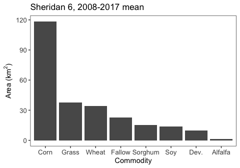
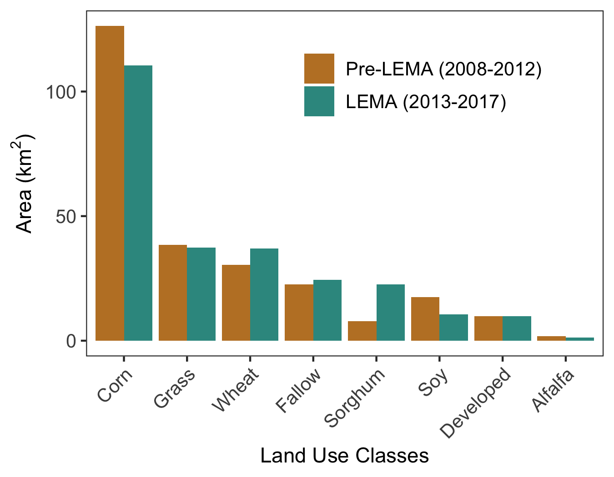

Goal: Summarize dominant crops in the LEMA project study area 


**R Packages Needed**


```r
library(tidyverse)
library(stringr)
library(here)

sessionInfo()
```

```
## R version 3.5.1 (2018-07-02)
## Platform: x86_64-apple-darwin15.6.0 (64-bit)
## Running under: macOS  10.14
## 
## Matrix products: default
## BLAS: /Library/Frameworks/R.framework/Versions/3.5/Resources/lib/libRblas.0.dylib
## LAPACK: /Library/Frameworks/R.framework/Versions/3.5/Resources/lib/libRlapack.dylib
## 
## locale:
## [1] en_US.UTF-8/en_US.UTF-8/en_US.UTF-8/C/en_US.UTF-8/en_US.UTF-8
## 
## attached base packages:
## [1] stats     graphics  grDevices utils     datasets  methods   base     
## 
## other attached packages:
##  [1] here_0.1        forcats_0.3.0   stringr_1.4.0   dplyr_0.8.0.1  
##  [5] purrr_0.2.5     readr_1.1.1     tidyr_0.8.1     tibble_2.0.1   
##  [9] ggplot2_3.2.0   tidyverse_1.2.1
## 
## loaded via a namespace (and not attached):
##  [1] Rcpp_1.0.0       cellranger_1.1.0 pillar_1.3.1     compiler_3.5.1  
##  [5] tools_3.5.1      digest_0.6.16    lubridate_1.7.4  jsonlite_1.6    
##  [9] evaluate_0.11    nlme_3.1-137     gtable_0.2.0     lattice_0.20-35 
## [13] pkgconfig_2.0.2  rlang_0.4.5      cli_1.0.1        rstudioapi_0.7  
## [17] yaml_2.2.0       haven_1.1.2      withr_2.1.2      xml2_1.2.0      
## [21] httr_1.3.1       knitr_1.20       generics_0.0.2   hms_0.4.2       
## [25] rprojroot_1.3-2  grid_3.5.1       tidyselect_0.2.5 glue_1.3.0      
## [29] R6_2.2.2         readxl_1.1.0     rmarkdown_1.10   modelr_0.1.2    
## [33] magrittr_1.5     backports_1.1.2  scales_1.0.0     htmltools_0.3.6 
## [37] rvest_0.3.2      assertthat_0.2.0 colorspace_1.3-2 stringi_1.2.4   
## [41] lazyeval_0.2.1   munsell_0.5.0    broom_0.5.2      crayon_1.3.4
```

### user variables and directories


```r
baseDir <- here::here()
nassDir <- paste0(baseDir, '/data/tabular/NASS')
cdlName <- 'CDL_Sheridan_2006-2017_cleaned.csv'

sheridan <- read_csv(paste0(nassDir,'/',cdlName))
```

```
## Parsed with column specification:
## cols(
##   Year = col_integer(),
##   cdlCode = col_integer(),
##   cdlClassName = col_character(),
##   area_km2 = col_double()
## )
```


# Sheridan Stats
What are the CDL classes that cover 95% of the area? Or most of the area for 2008+


```r
# crops ever planted
unique(sheridan$cdlClassName)
```

```
##  [1] "Corn"                     "Sorghum"                 
##  [3] "Soybeans"                 "Sunflower"               
##  [5] "Winter Wheat"             "Alfalfa"                 
##  [7] "Fallow/Idle Cropland"     "Developed/Open Space"    
##  [9] "Grass/Pasture"            "Other Small Grains"      
## [11] "Open Water"               "Developed/Low Intensity" 
## [13] "Barren"                   "Deciduous Forest"        
## [15] "Woody Wetlands"           "Dbl Crop WinWht/Corn"    
## [17] "Dbl Crop WinWht/Sorghum"  "Oats"                    
## [19] "Dbl Crop WinWht/Soybeans" "Dry Beans"               
## [21] "Triticale"                "Other Hay/Non Alfalfa"
```

```r
# mean acres by crop
cropMeans8 <- sheridan %>%
  filter(Year > 2008) %>%
  group_by(cdlClassName) %>%
  # get mean crop type area over study period
  summarise(meanArea_km2 = mean(area_km2)) %>%
  arrange(-meanArea_km2) %>%
  # tally how much of the study area are covered by the ordered crops
  mutate(totalArea = sum(meanArea_km2),
         proportion = meanArea_km2/totalArea,
         cumArea = cumsum(meanArea_km2),
         cumproportion = cumArea/totalArea)

# check it
cropMeans8
```

```
## # A tibble: 21 x 6
##    cdlClassName     meanArea_km2 totalArea proportion cumArea cumproportion
##    <chr>                   <dbl>     <dbl>      <dbl>   <dbl>         <dbl>
##  1 Corn                  118.         257.    0.460      118.         0.460
##  2 Grass/Pasture          37.8        257.    0.147      156.         0.607
##  3 Winter Wheat           34.2        257.    0.133      190.         0.740
##  4 Fallow/Idle Cro…       23.0        257.    0.0892     213.         0.829
##  5 Sorghum                15.5        257.    0.0601     229.         0.889
##  6 Soybeans               13.9        257.    0.0539     243.         0.943
##  7 Developed/Open …        9.84       257.    0.0382     253.         0.981
##  8 Alfalfa                 1.42       257.    0.00551    254.         0.987
##  9 Sunflower               0.921      257.    0.00358    255.         0.990
## 10 Triticale               0.556      257.    0.00216    255.         0.992
## # … with 11 more rows
```

```r
# keep top classes only

classes <- c('Corn','Grass/Pasture','Winter Wheat','Fallow/Idle Cropland',
             'Sorghum','Soybeans','Developed/Open Space','Alfalfa')
majorCrops8 <- cropMeans8 %>%
  filter(cdlClassName %in% classes)

shortnames <- data.frame(cdlClassName = classes,
                         Commodity = c('Corn','Grass','Wheat','Fallow',
                                       'Sorghum','Soy', 'Dev.','Alfalfa'))
majorCrops8 <- majorCrops8 %>% 
  left_join(shortnames)
```

```
## Joining, by = "cdlClassName"
```

```
## Warning: Column `cdlClassName` joining character vector and factor,
## coercing into character vector
```

```r
# plot
position <- majorCrops8$Commodity
ggplot(majorCrops8, 
       aes(x=Commodity, y=meanArea_km2)) +
  geom_bar(stat='identity') + 
  ylab(expression(paste('Area (',km^2,')',sep=''))) + 
  scale_x_discrete(limits = position) +
  ggtitle('Sheridan 6, 2008-2017 mean') + 
  theme_bw() + theme(legend.title=element_blank(),
                     axis.text=element_text(size=10),
                     legend.text=element_text(size=10),
                     axis.title=element_text(size=11),
                     panel.grid.major = element_blank(),
                     panel.grid.minor = element_blank())
```

<!-- -->

```r
majorCrops8
```

```
## # A tibble: 8 x 7
##   cdlClassName meanArea_km2 totalArea proportion cumArea cumproportion
##   <chr>               <dbl>     <dbl>      <dbl>   <dbl>         <dbl>
## 1 Corn               118.        257.    0.460      118.         0.460
## 2 Grass/Pastu…        37.8       257.    0.147      156.         0.607
## 3 Winter Wheat        34.2       257.    0.133      190.         0.740
## 4 Fallow/Idle…        23.0       257.    0.0892     213.         0.829
## 5 Sorghum             15.5       257.    0.0601     229.         0.889
## 6 Soybeans            13.9       257.    0.0539     243.         0.943
## 7 Developed/O…         9.84      257.    0.0382     253.         0.981
## 8 Alfalfa              1.42      257.    0.00551    254.         0.987
## # … with 1 more variable: Commodity <fct>
```

## CDL by LEMA status
compare coverage dominance before/after LEMA: 5 year means


```r
# assign lema status
sheridan$isLema <- NA
sheridan[sheridan$Year < 2013,'isLema'] <- 0
sheridan[sheridan$Year >= 2013,'isLema'] <- 1

# mean acres by crop
cropMeansByLema <- sheridan %>%
  filter(Year >= 2008) %>%
  group_by(isLema, cdlClassName) %>%
  # get mean crop type area over study period
  summarise(meanArea_km2 = mean(area_km2)) %>%
  arrange(-meanArea_km2) %>%
  # tally how much of the study area are covered by the ordered crops
  mutate(totalArea = sum(meanArea_km2),
         proportion = meanArea_km2/totalArea,
         cumArea = cumsum(meanArea_km2),
         cumproportion = cumArea/totalArea)

# check it
cropMeansByLema %>% filter(isLema == 0)
```

```
## # A tibble: 18 x 7
## # Groups:   isLema [1]
##    isLema cdlClassName meanArea_km2 totalArea proportion cumArea
##     <dbl> <chr>               <dbl>     <dbl>      <dbl>   <dbl>
##  1      0 Corn            126.           256.  0.493        126.
##  2      0 Grass/Pastu…     38.4          256.  0.150        165.
##  3      0 Winter Wheat     30.4          256.  0.119        195.
##  4      0 Fallow/Idle…     22.6          256.  0.0883       218.
##  5      0 Soybeans         17.5          256.  0.0683       235.
##  6      0 Developed/O…      9.84         256.  0.0384       245.
##  7      0 Sorghum           7.83         256.  0.0306       253.
##  8      0 Alfalfa           1.73         256.  0.00677      255.
##  9      0 Sunflower         0.946        256.  0.00369      255.
## 10      0 Dbl Crop Wi…      0.466        256.  0.00182      256.
## 11      0 Dbl Crop Wi…      0.0441       256.  0.000172     256.
## 12      0 Dbl Crop Wi…      0.0424       256.  0.000165     256.
## 13      0 Oats              0.0267       256.  0.000104     256.
## 14      0 Barren            0.0217       256.  0.0000847    256.
## 15      0 Developed/L…      0.00817      256.  0.0000319    256.
## 16      0 Open Water        0.00787      256.  0.0000307    256.
## 17      0 Woody Wetla…      0.00532      256.  0.0000208    256.
## 18      0 Deciduous F…      0.00416      256.  0.0000163    256.
## # … with 1 more variable: cumproportion <dbl>
```

```r
cropMeansByLema %>% filter(isLema == 1)
```

```
## # A tibble: 20 x 7
## # Groups:   isLema [1]
##    isLema cdlClassName meanArea_km2 totalArea proportion cumArea
##     <dbl> <chr>               <dbl>     <dbl>      <dbl>   <dbl>
##  1      1 Corn            110.           257.  0.430        110.
##  2      1 Grass/Pastu…     37.4          257.  0.146        148.
##  3      1 Winter Wheat     36.9          257.  0.144        185.
##  4      1 Fallow/Idle…     24.4          257.  0.0950       209.
##  5      1 Sorghum          22.5          257.  0.0877       232.
##  6      1 Soybeans         10.6          257.  0.0413       242.
##  7      1 Developed/O…      9.86         257.  0.0384       252.
##  8      1 Alfalfa           1.18         257.  0.00460      253.
##  9      1 Sunflower         0.921        257.  0.00358      254.
## 10      1 Dbl Crop Wi…      0.613        257.  0.00239      255.
## 11      1 Triticale         0.556        257.  0.00216      256.
## 12      1 Dry Beans         0.495        257.  0.00193      256.
## 13      1 Other Hay/N…      0.469        257.  0.00183      256.
## 14      1 Oats              0.356        257.  0.00139      257.
## 15      1 Dbl Crop Wi…      0.144        257.  0.000559     257.
## 16      1 Open Water        0.0377       257.  0.000147     257.
## 17      1 Woody Wetla…      0.0208       257.  0.0000811    257.
## 18      1 Barren            0.0186       257.  0.0000723    257.
## 19      1 Developed/L…      0.0104       257.  0.0000406    257.
## 20      1 Deciduous F…      0.00278      257.  0.0000108    257.
## # … with 1 more variable: cumproportion <dbl>
```

```r
# keep top classes only

classes <- c('Corn','Grass/Pasture','Winter Wheat','Fallow/Idle Cropland',
             'Sorghum','Soybeans','Developed/Open Space','Alfalfa')

majorCropsLema <- cropMeansByLema %>%
  filter(cdlClassName %in% classes)

shortnames <- data.frame(cdlClassName = classes,
                         Commodity = c('Corn','Grass','Wheat','Fallow',
                                       'Sorghum','Soy', 'Developed','Alfalfa'))

# facet name key
facetNames <- data.frame(isLema = c(0,1),
                         facetName = factor(c('Pre-LEMA (2008-2012)','LEMA (2013-2017)'),
                                            levels = c('Pre-LEMA (2008-2012)','LEMA (2013-2017)')),
                         stringsAsFactors = F)


majorCropsLema <- majorCropsLema %>% 
  left_join(shortnames) %>%
  left_join(facetNames)
```

```
## Joining, by = "cdlClassName"
```

```
## Warning: Column `cdlClassName` joining character vector and factor,
## coercing into character vector
```

```
## Joining, by = "isLema"
```

```r
majorCropsLema
```

```
## # A tibble: 16 x 9
## # Groups:   isLema [2]
##    isLema cdlClassName meanArea_km2 totalArea proportion cumArea
##     <dbl> <chr>               <dbl>     <dbl>      <dbl>   <dbl>
##  1      0 Corn               126.        256.    0.493      126.
##  2      1 Corn               110.        257.    0.430      110.
##  3      0 Grass/Pastu…        38.4       256.    0.150      165.
##  4      1 Grass/Pastu…        37.4       257.    0.146      148.
##  5      1 Winter Wheat        36.9       257.    0.144      185.
##  6      0 Winter Wheat        30.4       256.    0.119      195.
##  7      1 Fallow/Idle…        24.4       257.    0.0950     209.
##  8      0 Fallow/Idle…        22.6       256.    0.0883     218.
##  9      1 Sorghum             22.5       257.    0.0877     232.
## 10      0 Soybeans            17.5       256.    0.0683     235.
## 11      1 Soybeans            10.6       257.    0.0413     242.
## 12      1 Developed/O…         9.86      257.    0.0384     252.
## 13      0 Developed/O…         9.84      256.    0.0384     245.
## 14      0 Sorghum              7.83      256.    0.0306     253.
## 15      0 Alfalfa              1.73      256.    0.00677    255.
## 16      1 Alfalfa              1.18      257.    0.00460    253.
## # … with 3 more variables: cumproportion <dbl>, Commodity <fct>,
## #   facetName <fct>
```

```r
# plot

position <- unique(majorCropsLema$Commodity)
ggplot(majorCropsLema, 
       aes(x=Commodity, y=meanArea_km2, fill = facetName)) +
  geom_bar(stat='identity', position = position_dodge()) + 
  ylab(expression(paste('Area (',km^2,')',sep=''))) + 
  xlab('Land Use Classes') +
    scale_fill_manual(values=rev(c("#35978f", "#bf812d"))) +
  scale_x_discrete(limits = position) +
  #ggtitle('Sheridan Mean CDL, 5 yr pre/post LEMA') + 
  theme_bw() + theme(legend.title=element_blank(),
                     legend.position = c(.65,.8),
                    # axis.title.x = element_blank(),
                     axis.text=element_text(size=10),
                     legend.text=element_text(size=10),
                     axis.title=element_text(size=11),
                     axis.text.x=element_text(angle = 45, hjust=1),
                     strip.text.x = element_text(size = 11),
                     panel.grid.major = element_blank(),
                     panel.grid.minor = element_blank())
```

<!-- -->


