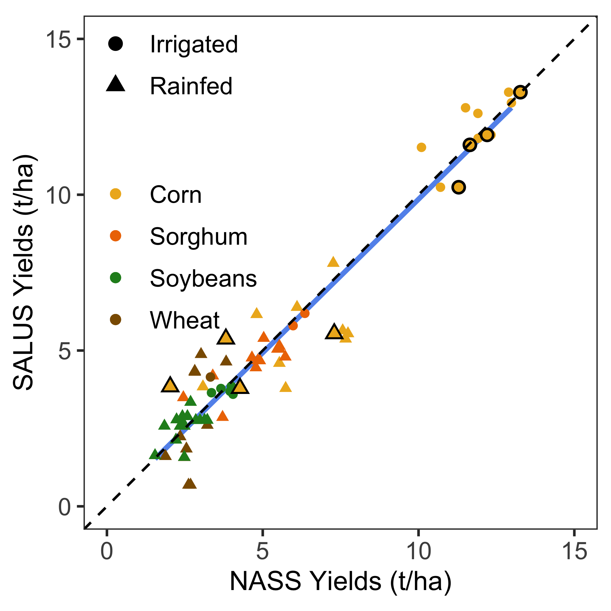
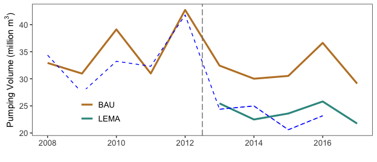

Goal: Make Figures for validating SALUS output for chosen models

* yield validation for 0018 model run 
* Water use for BAU and LEMA
* Corn yields for BAU and LEMA


**R Packages Needed**


```r
library(tidyverse)
library(lemon) # easy ggplot panel ticks
library(here)

# library(devtools)
# install_github('jdeines/salustools')
library(salustools) # for nqb theme

sessionInfo()
```

```
## R version 3.5.1 (2018-07-02)
## Platform: x86_64-apple-darwin15.6.0 (64-bit)
## Running under: macOS  10.14
## 
## Matrix products: default
## BLAS: /Library/Frameworks/R.framework/Versions/3.5/Resources/lib/libRblas.0.dylib
## LAPACK: /Library/Frameworks/R.framework/Versions/3.5/Resources/lib/libRlapack.dylib
## 
## locale:
## [1] en_US.UTF-8/en_US.UTF-8/en_US.UTF-8/C/en_US.UTF-8/en_US.UTF-8
## 
## attached base packages:
## [1] stats     graphics  grDevices utils     datasets  methods   base     
## 
## other attached packages:
##  [1] salustools_0.1.0 here_0.1         lemon_0.4.1      forcats_0.3.0   
##  [5] stringr_1.4.0    dplyr_0.8.0.1    purrr_0.2.5      readr_1.1.1     
##  [9] tidyr_0.8.1      tibble_2.0.1     ggplot2_3.2.0    tidyverse_1.2.1 
## 
## loaded via a namespace (and not attached):
##  [1] Rcpp_1.0.0       plyr_1.8.4       cellranger_1.1.0 pillar_1.3.1    
##  [5] compiler_3.5.1   tools_3.5.1      digest_0.6.16    lubridate_1.7.4 
##  [9] jsonlite_1.6     evaluate_0.11    nlme_3.1-137     gtable_0.2.0    
## [13] lattice_0.20-35  pkgconfig_2.0.2  rlang_0.4.5      cli_1.0.1       
## [17] rstudioapi_0.7   yaml_2.2.0       haven_1.1.2      gridExtra_2.3   
## [21] withr_2.1.2      xml2_1.2.0       httr_1.3.1       knitr_1.20      
## [25] generics_0.0.2   hms_0.4.2        rprojroot_1.3-2  grid_3.5.1      
## [29] tidyselect_0.2.5 glue_1.3.0       R6_2.2.2         readxl_1.1.0    
## [33] rmarkdown_1.10   modelr_0.1.2     magrittr_1.5     backports_1.1.2 
## [37] scales_1.0.0     htmltools_0.3.6  rvest_0.3.2      assertthat_0.2.0
## [41] colorspace_1.3-2 stringi_1.2.4    lazyeval_0.2.1   munsell_0.5.0   
## [45] broom_0.5.2      crayon_1.3.4
```


*Directories*


```r
baseDir <- here::here()

# nass yield summary
nassDir <- paste0(baseDir, '/data/tabular/NASS')

# salus output
salusDir <- paste0(baseDir, '/data/SALUS_output')
yieldValidModel <- '1_yieldCalibration_0018'
BAUmodel <- '2_BAU_0054'
LEMAmodel <- '3_LEMA_0086'

# wimas well data
wellDir <- paste0(baseDir, '/data/tabular/wellData')
wellFileName<- 'WIMAS_1996-2016_SheridanNull9_convertedUnits.csv'
```


# SALUS yield valiadation
Plot salus yield IQR against NASS, for rainfed and irrigation crops

## load and process NASS


```r
plotYear <- 2008

# state of kansas
nassState <- read_csv(paste0(nassDir,
                    '/NASS_yields_STATE_KS_2006-2017_4crops_CLEANED.csv')) %>%
  mutate(type = recode(type, "NON-IRRIGATED" = "Rainfed", 
                             "IRRIGATED" = "Irrigated", 
                             "ALL" = "Combined")) %>%
  # drop unneeded "coombineds"
  filter(!(type == "Combined" & crop %in% c('CORN'))) %>%
  filter(year >= plotYear) %>%
  dplyr::select(-c(yield_bu_acre, state_name)) %>%
  rename(stateNassYields = yield_kg_ha)
```

```
## Parsed with column specification:
## cols(
##   year = col_integer(),
##   crop = col_character(),
##   type = col_character(),
##   yield_kg_ha = col_double(),
##   yield_bu_acre = col_double(),
##   state_name = col_character()
## )
```

## load SALUS runs
load salus runs for chosen 0018, best yield fit with N off and water solid (75%, 25 mm)


```r
# converter for salus output
statusKey <- data.frame(type = c('Irrigated', 'Rainfed'),
                        irrigated = c('Y','N'),
                        stringsAsFactors = FALSE)

cropKey <- data.frame(crop = c('CORN','SORGHUM','WHEAT','SOYBEANS','ALFALFA'),
                      cropsalus = c('MZ','SG','WH','SB','AL'),
                      stringsAsFactors = FALSE)

# load yield tabular results
yields <- read_csv(paste0(salusDir,'/',yieldValidModel,'/results/yields_statsAndTotals.csv')) %>%
    rename(cropsalus = crop) %>%
  left_join(cropKey, by = 'cropsalus') %>%
  left_join(statusKey, by = 'irrigated') %>%
  dplyr::select(c(year, crop, type, yield_Q1_kgha, yield_median_kgha, 
                  yield_Q3_kgha))  %>%
  filter(crop != 'ALFALFA') %>%
  filter(year >= plotYear)
```

```
## Parsed with column specification:
## cols(
##   year = col_integer(),
##   irrigated = col_character(),
##   crop = col_character(),
##   yield_total_kg = col_double(),
##   yield_min_kgha = col_double(),
##   yield_Q1_kgha = col_double(),
##   yield_median_kgha = col_double(),
##   yield_mean_kgha = col_double(),
##   yield_Q3_kgha = col_integer(),
##   yield_max_kgha = col_integer()
## )
```

```r
# combine data
yieldValid <- yields %>%
  full_join(nassState, by = c('year','crop','type'))

# assoicate nass state combined with salus rainfed
yieldValidSimple <- yieldValid %>%
  # assign 'combined' nass data to rainfed
    mutate(type2 = recode(type, 'Combined' = 'Rainfed')) %>%
  mutate(crop = recode(crop, 'CORN' = 'Corn', 'SORGHUM' = 'Sorghum',
                       'SOYBEANS' = 'Soybeans','WHEAT' = 'Wheat'))

# extract and smoosh back together
nasser <- yieldValidSimple %>% 
  select(c(year, crop, type2, stateNassYields)) %>%
  filter(!is.na(stateNassYields))

# assoicate nass state combined with salus rainfed
yieldValidState <- yieldValidSimple %>%
  select(c(year, crop, type2, yield_median_kgha)) %>%
  filter(!is.na(yield_median_kgha)) %>%
  left_join(nasser, by = c('year','crop','type2'))
```

## Plot!
yield validation


```r
# plot it
ggplot(yieldValidState,
       aes(x=stateNassYields/1000, y = yield_median_kgha/1000, color=crop)) +
      stat_smooth(method = 'lm', se=F, size=1, colour='cornflowerblue') +
  geom_point(aes(shape = type2)) +
  scale_shape_manual(values = c(16, 4)) +
    geom_abline(slope = 1, intercept = 0, linetype='dashed') + 
     coord_equal(xlim=c(0,15), ylim=c(0,15)) + 
  scale_color_manual(values=c('goldenrod2','darkorange2','forestgreen','orange4'))+
  ylab('SALUS Yields (t/ha)') + xlab('NASS State Yields (t/ha)') +
   theme_bw() + theme(legend.position = c(.18,.69),
                      legend.background = element_blank(),
                     legend.title = element_blank(),
                     legend.key = element_blank(),
                    panel.grid = element_blank(),
                     axis.text=element_text(size=10),
                     legend.text=element_text(size=10),
                     axis.title=element_text(size=11))
```

```
## Warning: Removed 24 rows containing non-finite values (stat_smooth).
```

```
## Warning: Removed 24 rows containing missing values (geom_point).
```

<!-- -->

```r
simpleAgreement <- lm(yield_median_kgha~stateNassYields, data=yieldValidState)
summary(simpleAgreement)
```

```
## 
## Call:
## lm(formula = yield_median_kgha ~ stateNassYields, data = yieldValidState)
## 
## Residuals:
##     Min      1Q  Median      3Q     Max 
## -2176.2  -356.2   -51.2   580.5  1900.8 
## 
## Coefficients:
##                  Estimate Std. Error t value Pr(>|t|)    
## (Intercept)       0.91364  214.87461   0.004    0.997    
## stateNassYields   0.98555    0.03638  27.091   <2e-16 ***
## ---
## Signif. codes:  0 '***' 0.001 '**' 0.01 '*' 0.05 '.' 0.1 ' ' 1
## 
## Residual standard error: 915.8 on 62 degrees of freedom
##   (24 observations deleted due to missingness)
## Multiple R-squared:  0.9221,	Adjusted R-squared:  0.9208 
## F-statistic: 733.9 on 1 and 62 DF,  p-value: < 2.2e-16
```

## Quantify SALUS and NASS yield agreement


```r
precDiffs <- yieldValid %>%
  select(-c(yield_Q1_kgha,yield_Q3_kgha)) %>%
  # calculate percent difference
  mutate(percDiff = ((yield_median_kgha - stateNassYields) / stateNassYields)*100) %>%
  arrange(crop,type,year)

precDiffs %>%
  filter(type == 'Irrigated') %>%
  group_by(crop) %>%
  summarize(maxDisagree = max(abs(percDiff), na.rm=T))
```

```
## # A tibble: 4 x 2
##   crop     maxDisagree
##   <chr>          <dbl>
## 1 CORN           14.1 
## 2 SORGHUM         2.97
## 3 SOYBEANS       11.1 
## 4 WHEAT          24.9
```


# Water validation figure

## load and format data

### WIMAS well data


```r
# load wimas data for sheridan 6
wimas <- read_csv(paste0(wellDir, '/', wellFileName)) %>%
  filter(masterid == 'sheridan')  
```

```
## Parsed with column specification:
## cols(
##   masterid = col_character(),
##   year = col_integer(),
##   PDIV_ID = col_integer(),
##   crop = col_integer(),
##   volume_m3 = col_double(),
##   area_m2 = col_double(),
##   depth_m = col_double(),
##   system = col_integer()
## )
```

```r
# count wells in study area duing study period
wimas %>% 
  filter(year > 2005 & year < 2018) %>%
  filter(!is.na(volume_m3)) %>%
  group_by(PDIV_ID) %>%
  slice(1) %>%
  nrow()
```

```
## [1] 195
```

```r
# get annual volume totals and format to join with SALUS
wimasAnnual <- wimas %>%
  group_by(year) %>%
  summarise(wimasVolume_m3 = sum(volume_m3, na.rm=TRUE),
            wimasArea_m2 = sum(area_m2, na.rm=TRUE),
            wimasDepth_mm = mean(depth_m * 1000, na.rm=TRUE)) %>%
  mutate(wimasArea_ha = wimasArea_m2 * 1e-4,
         wimasVolume_km3 = wimasVolume_m3 * 1e-9,
         datasource = 'WIMAS') %>%
  dplyr::select(c(year, wimasVolume_km3))
```

### SALUS water results
load and combine with WIMAS


```r
bau <- read_csv(paste0(salusDir,'/', BAUmodel, '/results/WaterVars_meansTotals.csv')) %>%
  mutate(runID = '0054')
```

```
## Parsed with column specification:
## cols(
##   year = col_integer(),
##   variable = col_character(),
##   totalVolume_m3 = col_double(),
##   totalVolume_km3 = col_double(),
##   depth_min_mm = col_double(),
##   depth_Q1_mm = col_double(),
##   depth_median_mm = col_double(),
##   depth_mean_mm = col_double(),
##   depth_Q3_mm = col_double(),
##   depth_max_mm = col_double()
## )
```

```r
lema <- read_csv(paste0(salusDir,'/', LEMAmodel, '/results/WaterVars_meansTotals.csv')) %>%
  mutate(runID = '0086')
```

```
## Parsed with column specification:
## cols(
##   year = col_integer(),
##   variable = col_character(),
##   totalVolume_m3 = col_double(),
##   totalVolume_km3 = col_double(),
##   depth_min_mm = col_double(),
##   depth_Q1_mm = col_double(),
##   depth_median_mm = col_double(),
##   depth_mean_mm = col_double(),
##   depth_Q3_mm = col_double(),
##   depth_max_mm = col_double()
## )
```

```r
water <- bau %>%
  bind_rows(lema) %>%
  mutate(datasource = 'salus') %>%
  filter(variable == 'irrigation') %>%
  mutate(salusVolume_km3 = totalVolume_m3 * 1e-9) %>%
  select(c(runID, year, salusVolume_km3))

master <- water %>%
  left_join(wimasAnnual, by = c('year'))

# assume a 90% efficiency -------------------------------
master$salusVol_90adj <- master$salusVolume_km3 / 0.9

plotYear <- 2008
summary <- master %>%
  filter(year >= plotYear & runID %in% c('0054','0086')) %>%
  mutate(runID = recode(runID, '0086' = 'LEMA', '0054' = 'BAU'))
```


## Plot Pumping: WIMAS and Runs


```r
# water: remove LEMA scenario pre-lema data
waterplot <- summary %>%
  filter(!(runID == 'LEMA' & year < 2013)) 

# convert km3 to million m3 with 1e3
ggplot(waterplot,
       aes(x=year, y = salusVol_90adj*1e3, color = runID, group = runID)) +
  geom_line(lwd=1.1) + 
  # add wimas
  geom_line(data = waterplot, 
      aes(x=year, y = wimasVolume_km3*1e3), color = 'blue', linetype='dashed') +
  geom_vline(xintercept = 2012.5, color = 'gray50', linetype = 'longdash') +
  scale_x_continuous(breaks = c(2008,2010,2012,2014,2016)) +
   scale_color_manual(values=rev(c("#35978f", "#bf812d"))) +
  ylab(expression(paste('Pumping Volume (million ',m^3,')',sep=''))) +
  xlab('') +
  theme_bw() + theme(legend.position = c(.2,.2), 
                     legend.title = element_blank(),
                    panel.grid = element_blank(),
                     axis.text=element_text(size=10),
                     legend.text=element_text(size=10),
                     axis.title=element_text(size=11))
```

```
## Warning: Removed 2 rows containing missing values (geom_path).
```

<!-- -->

## Estimated water savings
How much less pumping occurred in the BAU model vs the LEMA model?

### aggregate 5 year total


```r
waterplot %>%
  filter(year >= 2013)
```

```
## # A tibble: 10 x 5
##    runID  year salusVolume_km3 wimasVolume_km3 salusVol_90adj
##    <chr> <int>           <dbl>           <dbl>          <dbl>
##  1 BAU    2013          0.0292          0.0244         0.0324
##  2 BAU    2014          0.0270          0.0250         0.0300
##  3 BAU    2015          0.0275          0.0206         0.0305
##  4 BAU    2016          0.0330          0.0232         0.0366
##  5 BAU    2017          0.0262         NA              0.0291
##  6 LEMA   2013          0.0229          0.0244         0.0255
##  7 LEMA   2014          0.0202          0.0250         0.0225
##  8 LEMA   2015          0.0212          0.0206         0.0236
##  9 LEMA   2016          0.0232          0.0232         0.0258
## 10 LEMA   2017          0.0196         NA              0.0217
```

```r
diffInTotalWater <- waterplot %>%
  filter(year >= 2013) %>%
  group_by(runID) %>%
  summarize(totalWaterSALUS = sum(salusVol_90adj))
diffInTotalWater
```

```
## # A tibble: 2 x 2
##   runID totalWaterSALUS
##   <chr>           <dbl>
## 1 BAU             0.159
## 2 LEMA            0.119
```

```r
# magnitude change
diffInTotalWater[diffInTotalWater$runID == 'BAU',2] - 
  diffInTotalWater[diffInTotalWater$runID == 'LEMA',2]
```

```
##   totalWaterSALUS
## 1      0.03962983
```

```r
# percent change
(1-(diffInTotalWater[diffInTotalWater$runID == 'LEMA',2]/diffInTotalWater[diffInTotalWater$runID == 'BAU',2])) * 100
```

```
##   totalWaterSALUS
## 1        24.96525
```

### mean annual


```r
# mean annual lema pumpnig
diffInTotalWater[diffInTotalWater$runID == 'LEMA',2] / 5
```

```
##   totalWaterSALUS
## 1      0.02382203
```

```r
# mean annual BAU pumpnig
diffInTotalWater[diffInTotalWater$runID == 'BAU',2] / 5
```

```
##   totalWaterSALUS
## 1      0.03174799
```

```r
# percent change
(1-((diffInTotalWater[diffInTotalWater$runID == 'LEMA',2] /5)/
      (diffInTotalWater[diffInTotalWater$runID == 'BAU',2]/5))) * 100
```

```
##   totalWaterSALUS
## 1        24.96525
```

```r
# absolute reduction annualized?
(diffInTotalWater[diffInTotalWater$runID == 'BAU',2] / 5 ) - (
diffInTotalWater[diffInTotalWater$runID == 'LEMA',2] / 5)
```

```
##   totalWaterSALUS
## 1     0.007925966
```


