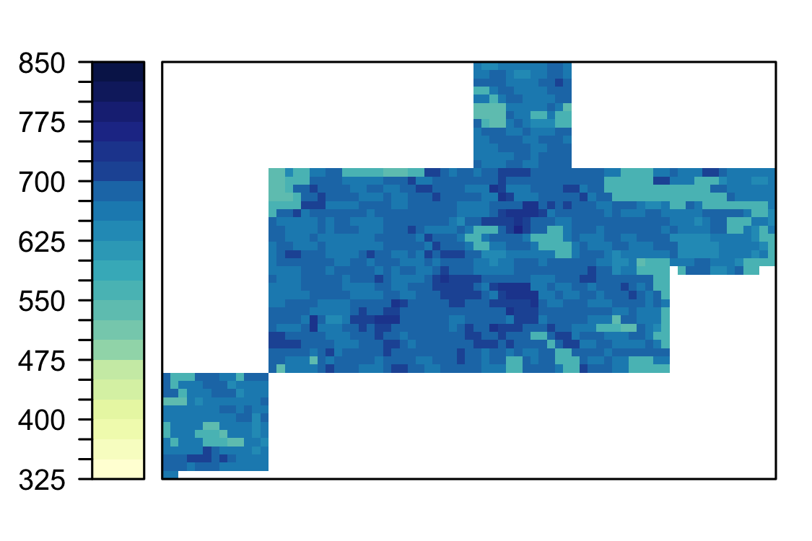
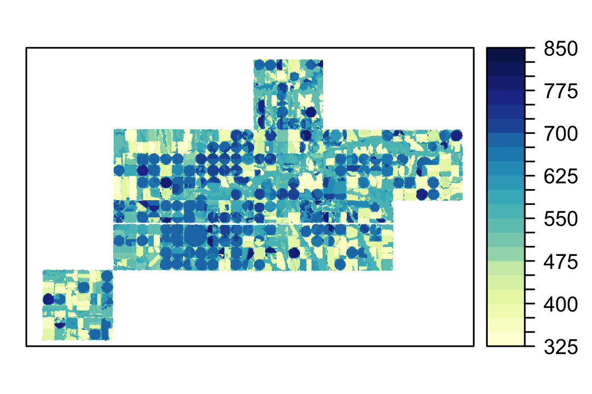
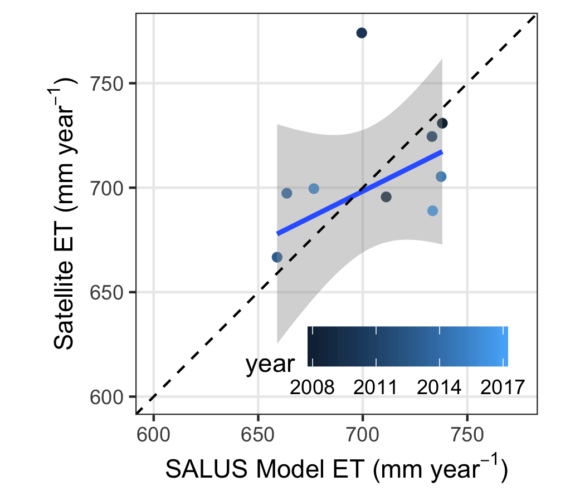
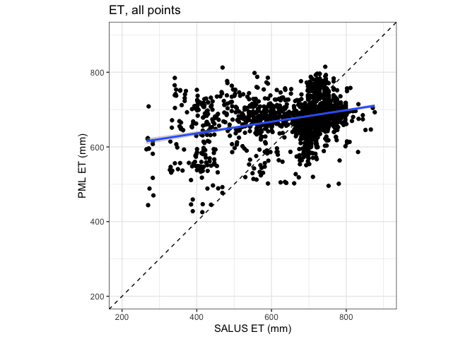
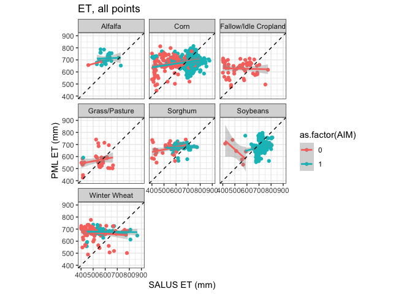
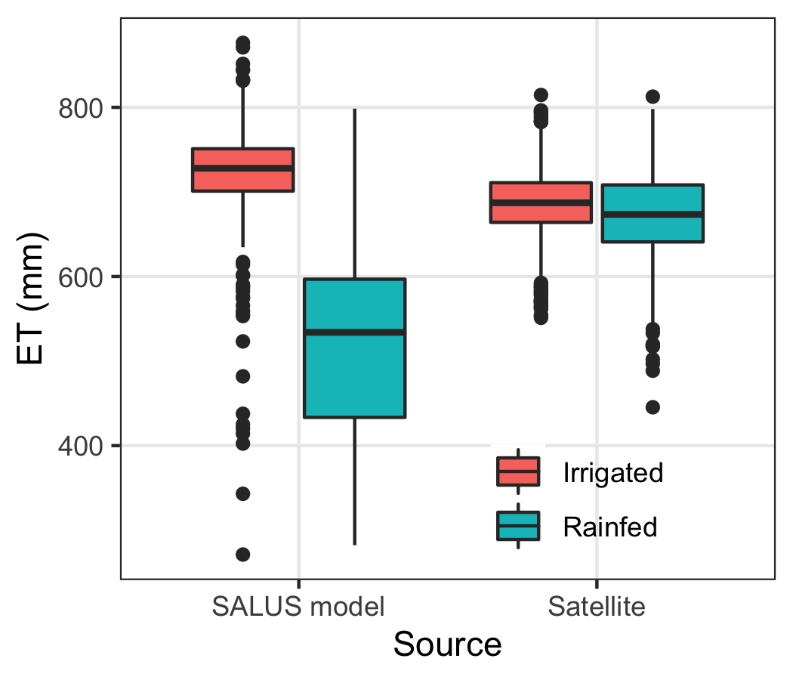

Goal: Check SALUS estimated ET against a satellite product for irrigated pixels


**R Packages Needed**


```r
library(tidyverse)
library(lubridate)
library(sf)
library(rgdal)
library(raster)
library(RColorBrewer)
library(here)

# function to easily calculate agreement
source(paste0(here::here(), '/code/misc_functions/calcStats.R'))

sessionInfo()
```

```
## R version 3.5.1 (2018-07-02)
## Platform: x86_64-apple-darwin15.6.0 (64-bit)
## Running under: macOS  10.14.6
## 
## Matrix products: default
## BLAS: /Library/Frameworks/R.framework/Versions/3.5/Resources/lib/libRblas.0.dylib
## LAPACK: /Library/Frameworks/R.framework/Versions/3.5/Resources/lib/libRlapack.dylib
## 
## locale:
## [1] en_US.UTF-8/en_US.UTF-8/en_US.UTF-8/C/en_US.UTF-8/en_US.UTF-8
## 
## attached base packages:
## [1] stats     graphics  grDevices utils     datasets  methods   base     
## 
## other attached packages:
##  [1] here_0.1           RColorBrewer_1.1-2 raster_2.6-7      
##  [4] rgdal_1.3-4        sp_1.3-1           sf_0.8-1          
##  [7] lubridate_1.7.4    forcats_0.3.0      stringr_1.4.0     
## [10] dplyr_0.8.0.1      purrr_0.2.5        readr_1.1.1       
## [13] tidyr_0.8.1        tibble_2.0.1       ggplot2_3.2.0     
## [16] tidyverse_1.2.1   
## 
## loaded via a namespace (and not attached):
##  [1] tidyselect_0.2.5   haven_1.1.2        lattice_0.20-35   
##  [4] colorspace_1.3-2   generics_0.0.2     htmltools_0.3.6   
##  [7] yaml_2.2.0         rlang_0.4.5        e1071_1.7-0       
## [10] pillar_1.3.1       glue_1.4.2         withr_2.1.2       
## [13] DBI_1.0.0          modelr_0.1.2       readxl_1.1.0      
## [16] munsell_0.5.0      gtable_0.2.0       cellranger_1.1.0  
## [19] rvest_0.3.2        evaluate_0.11      knitr_1.20        
## [22] class_7.3-14       fansi_0.4.2        broom_0.5.2       
## [25] Rcpp_1.0.6         KernSmooth_2.23-15 scales_1.0.0      
## [28] backports_1.1.2    classInt_0.4-2     jsonlite_1.7.2    
## [31] hms_0.4.2          digest_0.6.16      stringi_1.2.4     
## [34] grid_3.5.1         rprojroot_1.3-2    cli_2.2.0         
## [37] tools_3.5.1        magrittr_2.0.1     lazyeval_0.2.1    
## [40] crayon_1.3.4       pkgconfig_2.0.2    xml2_1.2.0        
## [43] assertthat_0.2.1   rmarkdown_1.10     httr_1.3.1        
## [46] rstudioapi_0.7     R6_2.5.0           units_0.6-1       
## [49] nlme_3.1-137       compiler_3.5.1
```

*Data Notes*
Satellite estimations of ET were acquired through Earth Engine; description: “Penman-Monteith-Leuning Evapotranspiration V2 (PML_V2) The PML_V2 products perform well against observations at 95 flux sites across globe, and are similar to or noticeably better than major state-of-the-art ET and GPP products widely used by water and ecology science communities (Zhang et al., 2019).”

https://developers.google.com/earth-engine/datasets/catalog/CAS_IGSNRR_PML_V2


*Directories*


```r
baseDir <- here::here()

# salus output
salusDir <- paste0(baseDir, '/data/SALUS_output')
LEMAmodel <- '3_LEMA_0086'

# irrigated area to mask with
irrDir <- paste0(baseDir, '/data/gis/irrigationMaps')
irrBase <- '_gmd4plus_AIM-HPA_test3clean3_aea.tif'

# sd6 outline
gisDir <- paste0(baseDir, '/data/gis')
sd6Name <- 'Sheridan6_fromKGS_sd6.shp'

# pml ET data
etDir <- paste0(baseDir, '/data/ET_validation')
etRasterName <- '2014_ET_PML.tif'
etFileName <- 'PML_v2_ETvars_s6mean_irrigatedAreaOnly2_allE_2005-2017.csv' # full region
pmlBase <- 'PML_v2_ETvars_points200_manual_'  # 200 mannual points

cdlDir <- paste0(gisDir,'/CDL_cleaned')
cdlBase <- '_CDL_gmd4PlusClips_aea_despeckRoads.tif'
cdlKeyFilepath <- paste0(baseDir,'/data/tabular/NASS/CDL_key_2014.csv')
```

# Vis Maps
compare maps of total ET from SALUS vs satellite products. Randomly chose 2014 for visualization. PML raster was exported from Earth Engine


```r
# load SD6
sd6 <- read_sf(paste0(gisDir, '/', sd6Name)) %>%
  st_transform(3857) %>%
  as(., "Spatial")

# load PML export
pml2014_a <- raster(paste0(etDir,'/',etRasterName))
pml2014 <- mask(pml2014_a, sd6)

# load salus ET raster for LEMA scenario and reproject to mercator
r0086 <- readRDS(paste0(salusDir,'/',LEMAmodel,'/results/etac_stack.rds'))
lema <- r0086[['X2014']]
lema_merc <- projectRaster(lema, crs = projection(pml2014))

# plot
colorbreaks <- seq(325, 852, 25)
labels <- c('325','','','400','','','475','','','550','','','625','','',
            '700','','','775','','','850')
pal <- colorRampPalette(RColorBrewer::brewer.pal(9,'YlGnBu'))

spplot(pml2014, col.regions=pal(23),
       at = colorbreaks,
       colorkey = list(labels = labels, space = 'left'))
```

<!-- -->

```r
spplot(lema_merc, col.regions=pal(23),   
       at = colorbreaks,  maxpixels = 800000,
       colorkey = list(labels = labels))
```

<!-- -->

# Compare ET: All irrigated areas
Our analysis only looks at the differences in ET/irrigated areas, so we compare SALUS LEMA scenario ET and PML ET for all irrigated pixels (identified with AIM-HPA mask)

## SALUS ET: irrigated areas 
get mean annual ET over irrigated areas from the SALUS LEMA scenario


```r
# load salus output: ET stack and subset for study years
r0086 <- readRDS(paste0(salusDir,'/',LEMAmodel,'/results/etac_stack.rds'))
years <- 2008:2017

# mask non-irrigated areas on each salus output map with aim-hpa
irrET_salus_list <- list()
for (i in 1:length(years)){
  
  # extract year's raster
  etRas <- r0086[[paste0('X',years[i])]]
  
   # aim 
  aim <- raster(paste0(irrDir, '/', years[i], irrBase))
  aimCrop <- crop(aim, etRas)
  aimCrop[aimCrop !=1] <- NA
 
  etRasIrr <- mask(etRas, aimCrop)
  
  irrET_salus_list[[i]] <- etRasIrr
}
irrET_salus <- stack(irrET_salus_list)
#spplot(irrET_salus)

# get regional mean ET for all irrigated areas
salusIrrMeans <- cellStats(irrET_salus, 'mean')
salusIrrMeans
```

```
##    X2008    X2009    X2010    X2011    X2012    X2013    X2014    X2015 
## 738.0407 711.1808 699.4834 733.0882 685.1284 659.0177 663.6796 737.4588 
##    X2016    X2017 
## 676.5903 733.4214
```


```r
#load - summed cell values for SD6
pml_raw <- read_csv('/Users/deinesji/Google Drive/GEE_Lema2/lema2_tableExports/lema2_gridmetTables/PML_v2_ETvars_s6mean_2005-2017.csv') %>%
  dplyr::select(-c(`system:index`,`.geo`))
```

```
## Parsed with column specification:
## cols(
##   `system:index` = col_character(),
##   Ec = col_double(),
##   Ei = col_double(),
##   Es = col_double(),
##   GMD4_HPA = col_integer(),
##   day = col_integer(),
##   sqmiles = col_double(),
##   .geo = col_character()
## )
```

```r
# format
pml <- pml_raw %>%
  mutate(date = ymd(day),
         year = year(date),
         # convert mm/day to mm/8day
         Ec_8day = Ec * 8,
         Es_8day = Es * 8,
         # convert mm/8day to water volume per SD6 (256 km2)
         Ec_sd6 = (Ec_8day/1000)* 256000000,
         Es_sd6 = (Es_8day/1000) * 256000000) %>%
  group_by(year) %>%
  summarize(Ec_annual_m3 = sum(Ec_sd6),
            Es_annual_m3 = sum(Es_sd6)) %>%
  mutate(Et_annual_m3 = Es_annual_m3 + Ec_annual_m3)

pml
```

```
## # A tibble: 13 x 4
##     year Ec_annual_m3 Es_annual_m3 Et_annual_m3
##    <dbl>        <dbl>        <dbl>        <dbl>
##  1  2005    92193061.    91854539.   184047600.
##  2  2006    77567628.    91577275.   169144903.
##  3  2007    97559329.    83408337.   180967665.
##  4  2008    84100285.    94260457.   178360743.
##  5  2009    92738186.    76659147.   169397333.
##  6  2010    92198905.    95649501.   187848406.
##  7  2011    87621730.    89122545.   176744275.
##  8  2012    75399551.    72175593.   147575144.
##  9  2013    73238812.    90410344.   163649156.
## 10  2014    81998582.    87909466.   169908047.
## 11  2015    85372792.    85697773.   171070565.
## 12  2016    96121984.    74796681.   170918665.
## 13  2017    88479185.    78744641.   167223826.
```


## Load PML and compare
PML ET was sampled in Google Earth Engine at 30 m resolution, masked with AIM-HPA


```r
#load - mean values over irriagted fields for SD6
pml_irr <- read_csv(paste0(etDir,'/', etFileName)) %>%
  dplyr::select(-c(`system:index`,`.geo`))
```

```
## Parsed with column specification:
## cols(
##   `system:index` = col_character(),
##   GMD4_HPA = col_integer(),
##   mean = col_double(),
##   sqmiles = col_double(),
##   sum = col_double(),
##   year = col_integer(),
##   .geo = col_character()
## )
```

```r
# format
ET_irrAreaCompare <- pml_irr %>%
  filter(year > 2007) %>%
  dplyr::select(c(year, mean)) %>%
  rename(PML_irrMean_mm = mean) %>%
  mutate(SALUS_irrMean_mm = salusIrrMeans)

# mean mm/year
ggplot(ET_irrAreaCompare, aes(x = SALUS_irrMean_mm, y = PML_irrMean_mm, color = year)) +
  geom_point() +
  geom_smooth(method = 'lm') +
  geom_abline(slope = 1, intercept = 0, linetype='dashed') +
  coord_equal() + xlim(600, 775) + ylim(600, 775) +
   ylab(expression(paste('Satellite ET (mm ',year^-1,')',sep=''))) +
    xlab(expression(paste('SALUS Model ET (mm ',year^-1,')',sep=''))) +
  scale_color_continuous(breaks = c(2008, 2011, 2014, 2017)) + 
  theme_bw() + theme(legend.position=c(.6,.13),
                     legend.direction = 'horizontal',
                     legend.background = element_blank(),
                      panel.grid.minor = element_blank())
```

<!-- -->

```r
# agreement metrics
calcStats(ET_irrAreaCompare$SALUS_irrMean_mm, ET_irrAreaCompare$PML_irrMean_mm)
```

```
##               r2     rmse       vecv      mae     mdae     me         r
## x_pred 0.1470492 38.84034 -0.9352556 31.33871 27.55347 3.5567 0.3834699
##                m      int    rmspe
## x_pred 0.4992469 348.8277 5.600536
```

```r
# value ranges
summary(ET_irrAreaCompare$SALUS_irrMean_mm)
```

```
##    Min. 1st Qu.  Median    Mean 3rd Qu.    Max. 
##   659.0   678.7   705.3   703.7   733.3   738.0
```

```r
summary(ET_irrAreaCompare$PML_irrMean_mm)
```

```
##    Min. 1st Qu.  Median    Mean 3rd Qu.    Max. 
##   618.6   690.6   698.4   700.2   719.7   774.1
```


# Point analysis: Manual
200 manual points per year visually/manually placed near field centers in attempt to minimize edge-pixel contamination in the lower resolution PML product.

## add attributes
for each point, add cleaned CDL value, cleaned AIM irrigation status, and SALUS ET estimates


```r
salusResultsDir <- paste0(salusDir,'/',LEMAmodel,'/results/')

cdlKey <- read_csv(cdlKeyFilepath) %>%
  rename(CDL = VALUE,
         CDLname = CLASS_NAME) %>%
  dplyr::select(c(CDL, CDLname))

etBase <- 'etac_stack.rds'

years <- 2008:2017

pointList <- list()
for (i in 1:length(years)){
  # load pml and spatialize to sp
  pointyear <- read_csv(paste0(etDir, '/', pmlBase, years[i],'.csv')) %>%
    dplyr::select(-c(`system:index`,`.geo`)) %>%
    st_as_sf(coords = c('longitude','latitude'), crs = 4326)  %>%
    st_transform(5070) %>%
    as(., 'Spatial')
  
  # load rasters
  cdl <- raster(paste0(cdlDir, '/', years[i], cdlBase))
  aim <- raster(paste0(irrDir, '/', years[i], irrBase))
  etac <- readRDS(paste0(salusResultsDir, '/', etBase))[[paste0('X',years[i])]]

  # stack
  cdlSmall <- crop(cdl, etac)
  aimSmall <- crop(aim, etac)
  attribute_stack <- stack(cdlSmall, aimSmall, etac)
  names(attribute_stack) <- c('CDL','AIM','etac')
  
  # get values at points
  attributeData <- extract(attribute_stack, pointyear)

  # format
  pointsOut <- as.tibble(cbind(pointyear, attributeData)) %>%
    rename(PML_soil = Es,
           PML_trans = Ec,
           salus_ET = etac,
           latitude = coords.x1,
           longitude = coords.x2) %>%
    mutate(PML_ET = PML_soil + PML_trans) %>%
    left_join(cdlKey) %>%
    dplyr::select(c(year, CDLname, CDL, AIM, latitude, longitude, everything()))
  
  pointList[[i]] <- pointsOut
}
```

```
## Warning: `as.tibble()` is deprecated, use `as_tibble()` (but mind the new semantics).
## This warning is displayed once per session.
```

```r
pointsAll <- do.call("rbind", pointList)
```

## compare

### salus 30 m


```r
# keep only salus simulated crops
pointsSalus <- pointsAll %>% filter(CDL %in% c(1,4,5,24,36, 61,176))

# all sampled
ggplot(pointsSalus, aes(x = salus_ET, y = PML_ET)) +
  geom_point() +
  geom_smooth(method = 'lm') +
  geom_abline(slope = 1, intercept = 0, linetype='dashed') +
  coord_equal() + xlim(200, 900) + ylim(200,900) +
  xlab('SALUS ET (mm)') + ylab('PML ET (mm)') +
  theme_bw() + ggtitle('ET, all points')
```

<!-- -->

```r
SCYMr::calcStats(pointsSalus$salus_ET, pointsSalus$PML_ET)
```

```
##               r2     rmse     vecv      mae     mdae        me        r
## x_pred 0.1141737 108.6009 -329.801 80.51068 59.75711 -9.520243 0.337896
##                m      int    rmspe
## x_pred 0.1552729 574.2634 16.30579
```

```r
# by crop type
ggplot(pointsSalus, aes(x = salus_ET, y = PML_ET, color = as.factor(AIM))) +
  geom_point() +
    geom_smooth(method = 'lm') +
  geom_abline(slope = 1, intercept = 0, linetype='dashed') +
  coord_equal() + xlim(400, 900) + ylim(400,900) +
  facet_wrap(~CDLname) +
  xlab('SALUS ET (mm)') + ylab('PML ET (mm)') +
  theme_bw() + ggtitle('ET, all points')
```

```
## Warning: Removed 74 rows containing non-finite values (stat_smooth).
```

```
## Warning in qt((1 - level)/2, df): NaNs produced
```

```
## Warning: Removed 74 rows containing missing values (geom_point).
```

<!-- -->

this isn't going anywhere - PML doesn't have the resolution


```r
# by irrigation status
irrStatus <- pointsSalus %>%
  dplyr::select(c(year, CDLname, CDL, AIM, salus_ET, PML_ET)) %>%
  tidyr::gather(., key = datasource, value = ET_mm, salus_ET:PML_ET)

visKey <- data.frame(datasource = c('salus_ET','PML_ET'),
                     datasource2 = c('SALUS model', 'Satellite'), 
                     stringsAsFactors = FALSE)

visKey2 <- data.frame(AIM = c(0,1),
                     AIM2 = c('Rainfed', 'Irrigated'), 
                     stringsAsFactors = FALSE)


irrStatus2 <- irrStatus %>%
  left_join(visKey) %>%
  left_join(visKey2)
```

```
## Joining, by = "datasource"
```

```
## Joining, by = "AIM"
```

```r
ggplot(irrStatus2 %>% filter(CDL %in% c(1,5)),
       aes(x = datasource2, y = ET_mm, fill = AIM2, group = interaction(AIM2,datasource2))) +
  geom_boxplot() +
  ylab('ET (mm)') + xlab('Source') +
  theme_bw() +   theme_bw() + theme(legend.position=c(.7,.16),
                                    legend.title = element_blank(),
                                    legend.background = element_blank(),
                                    panel.grid.minor = element_blank())
```

<!-- -->


