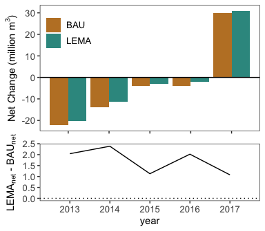

Goal: Compare Water Budget between scenarios. 


**R Packages Needed**


```r
library(tidyverse)
library(lemon) # easy ggplot panel ticks
library(raster)
library(rgdal)
library(here)
library(cowplot)

# library(devtools)
# install_github('jdeines/salustools')
library(salustools)

sessionInfo()
```

```
## R version 3.5.1 (2018-07-02)
## Platform: x86_64-apple-darwin15.6.0 (64-bit)
## Running under: macOS  10.14
## 
## Matrix products: default
## BLAS: /Library/Frameworks/R.framework/Versions/3.5/Resources/lib/libRblas.0.dylib
## LAPACK: /Library/Frameworks/R.framework/Versions/3.5/Resources/lib/libRlapack.dylib
## 
## locale:
## [1] en_US.UTF-8/en_US.UTF-8/en_US.UTF-8/C/en_US.UTF-8/en_US.UTF-8
## 
## attached base packages:
## [1] stats     graphics  grDevices utils     datasets  methods   base     
## 
## other attached packages:
##  [1] salustools_0.1.0 cowplot_0.9.3    here_0.1         rgdal_1.3-4     
##  [5] raster_2.6-7     sp_1.3-1         lemon_0.4.1      forcats_0.3.0   
##  [9] stringr_1.4.0    dplyr_0.8.0.1    purrr_0.2.5      readr_1.1.1     
## [13] tidyr_0.8.1      tibble_2.0.1     ggplot2_3.2.0    tidyverse_1.2.1 
## 
## loaded via a namespace (and not attached):
##  [1] tidyselect_0.2.5 haven_1.1.2      lattice_0.20-35  colorspace_1.3-2
##  [5] generics_0.0.2   htmltools_0.3.6  yaml_2.2.0       rlang_0.4.5     
##  [9] pillar_1.3.1     glue_1.3.0       withr_2.1.2      modelr_0.1.2    
## [13] readxl_1.1.0     plyr_1.8.4       munsell_0.5.0    gtable_0.2.0    
## [17] cellranger_1.1.0 rvest_0.3.2      evaluate_0.11    knitr_1.20      
## [21] broom_0.5.2      Rcpp_1.0.0       scales_1.0.0     backports_1.1.2 
## [25] jsonlite_1.6     gridExtra_2.3    hms_0.4.2        digest_0.6.16   
## [29] stringi_1.2.4    grid_3.5.1       rprojroot_1.3-2  cli_1.0.1       
## [33] tools_3.5.1      magrittr_1.5     lazyeval_0.2.1   crayon_1.3.4    
## [37] pkgconfig_2.0.2  xml2_1.2.0       lubridate_1.7.4  assertthat_0.2.0
## [41] rmarkdown_1.10   httr_1.3.1       rstudioapi_0.7   R6_2.2.2        
## [45] nlme_3.1-137     compiler_3.5.1
```

*Directories*


```r
# salus results folders
baseDir <- here::here()
salusOutputDir <- paste0(baseDir, '/data/SALUS_output')
BAUmodel <- '2_BAU_0054'
LEMAmodel <- '3_LEMA_0086'
```


# load data
BAU and LEMA model runs


```r
bau <- read_csv(paste0(salusOutputDir,'/', BAUmodel, '/results/WaterVars_meansTotals.csv')) %>%
  mutate(runID = '0054')
```

```
## Parsed with column specification:
## cols(
##   year = col_integer(),
##   variable = col_character(),
##   totalVolume_m3 = col_double(),
##   totalVolume_km3 = col_double(),
##   depth_min_mm = col_double(),
##   depth_Q1_mm = col_double(),
##   depth_median_mm = col_double(),
##   depth_mean_mm = col_double(),
##   depth_Q3_mm = col_double(),
##   depth_max_mm = col_double()
## )
```

```r
lema <- read_csv(paste0(salusOutputDir,'/', LEMAmodel, '/results/WaterVars_meansTotals.csv')) %>%
  mutate(runID = '0086')
```

```
## Parsed with column specification:
## cols(
##   year = col_integer(),
##   variable = col_character(),
##   totalVolume_m3 = col_double(),
##   totalVolume_km3 = col_double(),
##   depth_min_mm = col_double(),
##   depth_Q1_mm = col_double(),
##   depth_median_mm = col_double(),
##   depth_mean_mm = col_double(),
##   depth_Q3_mm = col_double(),
##   depth_max_mm = col_double()
## )
```

```r
water <- bau %>%
  bind_rows(lema) %>%
  # recalc totalVolume_km3 from m3
  dplyr::select(-c(totalVolume_km3)) %>%
  mutate(totalVolume_km3 = totalVolume_m3 * 1e-9) %>%
  dplyr::select(c(runID, year, variable, totalVolume_km3)) %>%
  mutate(runID = recode(runID, '0086' = 'LEMA', '0054' = 'BAU')) %>%
  filter(year >=2013) 

# adjust irrigation volume only by 90% efficiency ---------------

# account for 90% efficiency in salus estimated water volumes
adjustedIrr <- water %>% filter(variable == 'irrigation') %>%
  mutate(totalVolume_km3 = totalVolume_km3 / .9)

# replace in data frame
waterIrrAdj <- water %>% filter(variable != 'irrigation') %>%
  bind_rows(adjustedIrr)
```

# recharge numbers


```r
rechargeVols <- waterIrrAdj %>%
  filter(variable == 'recharge') %>%
  group_by(runID) %>%
  summarize(meanAnnualRechage = mean(totalVolume_km3),
            totalRecharge = sum(totalVolume_km3))
rechargeVols
```

```
## # A tibble: 2 x 3
##   runID meanAnnualRechage totalRecharge
##   <chr>             <dbl>         <dbl>
## 1 BAU              0.0289         0.145
## 2 LEMA             0.0227         0.114
```

```r
# percent decrease total
(1 - (rechargeVols[2,3] / rechargeVols[1,3] )) * 100
```

```
##   totalRecharge
## 1      21.43624
```


# Plot Water Budget Components

## annual water budgets - transpiration
for whole region (including rainfed)

epac = plant transpiration
esac = soil transpiration
recharge = deep percolation
rofc = runoff


```r
unique(waterIrrAdj$variable)
```

```
## [1] "recharge"   "precip"     "etac"       "esac"       "epac"      
## [6] "rofc"       "irrigation"
```

```r
# muliply km3 by 1e3 for legibility (million m3)
ggplot(waterIrrAdj %>% filter(!variable %in% c('etac','rofc','precip')),
       aes(x = year, y = totalVolume_km3*1e3, fill = runID)) +
  geom_bar(stat='identity', position = position_dodge()) +
  scale_fill_manual(values=rev(c("#35978f", "#bf812d"))) +
  facet_rep_wrap(~variable) +
  ylab(expression(paste('Volume (million ',m^3,')',sep=''))) +
  theme_bw() + theme(panel.grid = element_blank(),
                     legend.title = element_blank(),
                     legend.position = c(.1,.3),
                      axis.text=element_text(size=10),
                     legend.text=element_text(size=10),
                     axis.title=element_text(size=11))
```

<!-- -->

```r
# summarize epac and esac by year
waterIrrAdj %>% filter(variable %in% c('esac','epac','rofc')) %>%
  tidyr::spread(., key = runID, value = totalVolume_km3) %>%
  mutate(percdifference = ((LEMA - BAU)/BAU)*100,
         percDecrease = (1 - (LEMA/BAU))*100) %>%
  group_by(variable) %>%
  summarize(meanPercDiff = mean(percdifference),
            sdPercDiff = sd(percdifference),
            meanDecrease = mean(percDecrease),
            sdDecrease = sd(percDecrease))
```

```
## # A tibble: 3 x 5
##   variable meanPercDiff sdPercDiff meanDecrease sdDecrease
##   <chr>           <dbl>      <dbl>        <dbl>      <dbl>
## 1 epac           -0.732      0.570        0.732      0.570
## 2 esac           -0.619      0.134        0.619      0.134
## 3 rofc           -1.59       3.92         1.59       3.92
```

```r
# summarize epac and esac 5 year
waterIrrAdj %>% filter(variable %in% c('esac','epac','rofc')) %>%
  tidyr::spread(., key = runID, value = totalVolume_km3) %>%
  group_by(variable) %>%
  summarize(BAU = sum(BAU),
            LEMA = sum(LEMA)) %>%
  mutate(percDecrease = (1 - (LEMA/BAU))*100) 
```

```
## # A tibble: 3 x 4
##   variable     BAU    LEMA percDecrease
##   <chr>      <dbl>   <dbl>        <dbl>
## 1 epac     0.315   0.313          0.643
## 2 esac     0.407   0.404          0.614
## 3 rofc     0.00631 0.00621        1.52
```

```r
# total change for these three
waterIrrAdj %>% filter(variable %in% c('esac','epac','rofc')) %>%
  tidyr::spread(., key = runID, value = totalVolume_km3) %>%
  #group_by(variable) %>%
  summarize(BAUtotal = sum(BAU),
            LEMAtotal = sum(LEMA)) %>%
  mutate(saved = BAUtotal-LEMAtotal)
```

```
## # A tibble: 1 x 3
##   BAUtotal LEMAtotal   saved
##      <dbl>     <dbl>   <dbl>
## 1    0.729     0.724 0.00462
```

note SUMMARIES WERE FOR WHOLE REGION...

## compare irrigation vs deep percolation
irrigation is the total water extracted (salus estimates adjusted by 90% efficiency) and deep percolation is the total amount calculated as drainage by salus across the region, including rainfall in both irrigated and dryland crops

deep percolation is called "recharge" in salus outputs


```r
# keep only irrigation and recharge, and make irrigation negative
inOutData <- waterIrrAdj %>%
  filter(variable %in% c('irrigation','recharge'))

ggplot(inOutData,
   aes(x = year, y = totalVolume_km3 * 1e3, fill = variable)) +
  geom_bar(stat='identity', position = position_dodge()) +
  #scale_fill_manual(values=rev(c("#35978f", "#bf812d"))) +
  facet_rep_wrap(~runID) +
    ylab(expression(paste('Volume (million ',m^3,')',sep=''))) +
  theme_bw() + theme(panel.grid = element_blank(),
                     legend.title = element_blank(),
                     legend.position = c(.13,.8),
                      axis.text=element_text(size=10),
                     legend.text=element_text(size=10),
                     axis.title=element_text(size=11))
```

<!-- -->

plot difference - by year


```r
netDiff <- inOutData %>%
  tidyr::spread(., key = variable, value = totalVolume_km3) %>%
  mutate(netChange = recharge - irrigation)

# totals
netDiff %>%
  group_by(runID) %>%
  summarize(pumping = sum(irrigation),
            recharge = sum(recharge),
            netChange = sum(netChange))
```

```
## # A tibble: 2 x 4
##   runID pumping recharge netChange
##   <chr>   <dbl>    <dbl>     <dbl>
## 1 BAU     0.159    0.145  -0.0142 
## 2 LEMA    0.119    0.114  -0.00556
```

```r
# by year
p1 <- ggplot(netDiff,
       aes(x=year, y = netChange * 1e3,fill=runID)) +
  geom_bar(stat='identity', position = position_dodge()) +
  ylab(expression(paste('Net Change (million ',m^3,')',sep=''))) +
  scale_fill_manual(values=rev(c("#35978f", "#bf812d"))) +
  geom_hline(yintercept = 0) +
  theme_bw() + theme(panel.grid = element_blank(),
                     legend.title = element_blank(),
                      axis.title.x = element_blank(),
                      axis.text.x = element_blank(),
                     legend.position = c(.13,.8),
                      axis.text=element_text(size=10),
                     legend.text=element_text(size=10),
                     axis.title=element_text(size=11))
p1
```

<!-- -->

plot difference - over all


```r
totalNet <- netDiff %>%
  group_by(runID) %>%
  summarize(totalNet = sum(netChange))

p2 <- ggplot(totalNet,
       aes(x=runID, y = totalNet * 1e3,fill=runID)) +
  geom_bar(stat='identity', position = position_dodge()) +
  ylab(expression(paste('Cumulative 5-Year Net Change (million ',m^3,')',sep=''))) +
  xlab('') +
  scale_fill_manual(values=rev(c("#35978f", "#bf812d"))) +
  theme_bw() + theme(panel.grid = element_blank(),
                     legend.title = element_blank(),
                     legend.position = 'none',
                      axis.text=element_text(size=10),
                     legend.text=element_text(size=10),
                     axis.title=element_text(size=11))
p2 
```

<!-- -->

```r
p2 
```

<!-- -->

```r
# increase in aquifer recharge:
changeInRecharge <- totalNet$totalNet[2] - totalNet$totalNet[1]
changeInRecharge * 1e3 # million m3
```

```
## [1] 8.647449
```

```r
# km3 / km2 = km * 1000 = m
totalDepthChange <- (changeInRecharge / 256) * 1000 # meters
totalDepthChange # m 
```

```
## [1] 0.0337791
```

```r
(totalDepthChange * 1000) #mm
```

```
## [1] 33.7791
```

```r
# depth change per year in mm
(totalDepthChange * 1000) /5
```

```
## [1] 6.755819
```


Line plot of diference over time


```r
# calculate bau vs lema net over time
netDiffRegions <- netDiff %>%
  dplyr::select(-c(irrigation, recharge)) %>%
  tidyr::spread(., key = runID, value = netChange) %>%
  mutate(regionDiff = LEMA - BAU)

# by year
p3 <- ggplot(netDiffRegions,
       aes(x=year, y = regionDiff*1e3)) +
  geom_line() +
 ylab(expression(paste(LEMA[net],' - ', BAU[net],sep=''))) +
    scale_x_continuous(limits = c(2012.5,2017.5)) +
  #xlab('') +
    geom_hline(yintercept = 0, linetype = 'dotted') +
  
  theme_bw() + theme(panel.grid = element_blank(),
                     legend.title = element_blank(),
                     legend.position = c(.13,.8),
                     # axis.title.x = element_blank(),
                     # axis.text.x = element_blank(),
                      axis.text=element_text(size=10),
                     legend.text=element_text(size=10),
                     axis.title=element_text(size=11))
p3
```

<!-- -->


stack line and bar


```r
plot_grid(p1,p3, align='v', nrow=2, rel_heights=c(.6,.4))
```

<!-- -->


