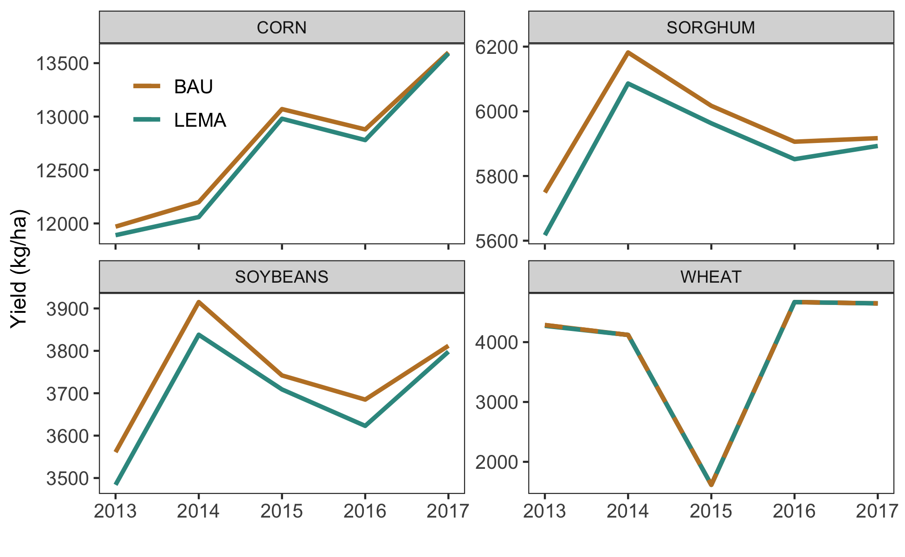

Goal: Analyze yield differences between scenarios + make figure


**R Packages Needed**


```r
library(tidyverse)
library(here)
library(lemon)

sessionInfo()
```

```
## R version 3.5.1 (2018-07-02)
## Platform: x86_64-apple-darwin15.6.0 (64-bit)
## Running under: macOS  10.14
## 
## Matrix products: default
## BLAS: /Library/Frameworks/R.framework/Versions/3.5/Resources/lib/libRblas.0.dylib
## LAPACK: /Library/Frameworks/R.framework/Versions/3.5/Resources/lib/libRlapack.dylib
## 
## locale:
## [1] en_US.UTF-8/en_US.UTF-8/en_US.UTF-8/C/en_US.UTF-8/en_US.UTF-8
## 
## attached base packages:
## [1] stats     graphics  grDevices utils     datasets  methods   base     
## 
## other attached packages:
##  [1] lemon_0.4.1     here_0.1        forcats_0.3.0   stringr_1.4.0  
##  [5] dplyr_0.8.0.1   purrr_0.2.5     readr_1.1.1     tidyr_0.8.1    
##  [9] tibble_2.0.1    ggplot2_3.2.0   tidyverse_1.2.1
## 
## loaded via a namespace (and not attached):
##  [1] Rcpp_1.0.0       plyr_1.8.4       cellranger_1.1.0 pillar_1.3.1    
##  [5] compiler_3.5.1   tools_3.5.1      digest_0.6.16    lubridate_1.7.4 
##  [9] jsonlite_1.6     evaluate_0.11    nlme_3.1-137     gtable_0.2.0    
## [13] lattice_0.20-35  pkgconfig_2.0.2  rlang_0.4.5      cli_1.0.1       
## [17] rstudioapi_0.7   yaml_2.2.0       haven_1.1.2      gridExtra_2.3   
## [21] withr_2.1.2      xml2_1.2.0       httr_1.3.1       knitr_1.20      
## [25] generics_0.0.2   hms_0.4.2        rprojroot_1.3-2  grid_3.5.1      
## [29] tidyselect_0.2.5 glue_1.3.0       R6_2.2.2         readxl_1.1.0    
## [33] rmarkdown_1.10   modelr_0.1.2     magrittr_1.5     backports_1.1.2 
## [37] scales_1.0.0     htmltools_0.3.6  rvest_0.3.2      assertthat_0.2.0
## [41] colorspace_1.3-2 stringi_1.2.4    lazyeval_0.2.1   munsell_0.5.0   
## [45] broom_0.5.2      crayon_1.3.4
```


*Directories*


```r
baseDir <- here::here()

# salus output ------------------
salusDir <- paste0(baseDir, '/data/SALUS_output')
BAUmodel <- '2_BAU_0054'
LEMAmodel <- '3_LEMA_0086'
```

# Yield Differences

## load


```r
cropKey <- data.frame(cropFull = c('CORN','SORGHUM','WHEAT','SOYBEANS','ALFALFA'),
                      crop = c('MZ','SG','WH','SB','AL'),
                      stringsAsFactors = FALSE)


bau <- read_csv(paste0(salusDir,'/', BAUmodel, '/results/yields_statsAndTotals.csv')) %>%
  mutate(runID = '0054')
```

```
## Parsed with column specification:
## cols(
##   year = col_integer(),
##   irrigated = col_character(),
##   crop = col_character(),
##   yield_total_kg = col_double(),
##   yield_min_kgha = col_double(),
##   yield_Q1_kgha = col_double(),
##   yield_median_kgha = col_double(),
##   yield_mean_kgha = col_double(),
##   yield_Q3_kgha = col_integer(),
##   yield_max_kgha = col_integer()
## )
```

```r
lema <- read_csv(paste0(salusDir,'/', LEMAmodel, '/results/yields_statsAndTotals.csv')) %>%
  mutate(runID = '0086')
```

```
## Parsed with column specification:
## cols(
##   year = col_integer(),
##   irrigated = col_character(),
##   crop = col_character(),
##   yield_total_kg = col_double(),
##   yield_min_kgha = col_double(),
##   yield_Q1_kgha = col_double(),
##   yield_median_kgha = col_double(),
##   yield_mean_kgha = col_double(),
##   yield_Q3_kgha = col_integer(),
##   yield_max_kgha = col_integer()
## )
```

```r
yield0 <- bau %>%
  bind_rows(lema) %>%
  filter(irrigated == 'Y') %>%
  mutate(datasource = 'salus') %>%
  left_join(cropKey, by = 'crop') %>%
    mutate(runID = recode(runID, '0086' = 'LEMA', '0054' = 'BAU')) %>%
  dplyr::select(c(year, cropFull, yield_median_kgha, runID)) %>%
  tidyr::spread(., key = cropFull, value = yield_median_kgha)
```


## Plot Run Yield Diffs: yield penalty
Plot for LEMA periods only


```r
# format for crop specific yield differences
yieldDiffs <- yield0 %>% 
  filter(year>=2013) %>%
  dplyr::select(c(year, runID, CORN, SORGHUM, SOYBEANS, WHEAT)) %>%
  tidyr::gather(., key = crop, value = median_yield_kgha, CORN:WHEAT)


ggplot(yieldDiffs,
       aes(year, median_yield_kgha, color = runID, group = runID)) +
  geom_line(lwd=1.08) +
  # add dashed line for wheat
  geom_line(data = yieldDiffs %>% filter(crop == 'WHEAT' & runID == 'BAU'), 
            linetype = 'dashed', lwd = 1.08) +
  facet_rep_wrap(~crop, scales = 'free_y', repeat.tick.labels = 'y') +
  ylab('Yield (kg/ha)') + xlab('') +
 # scale_x_continuous(breaks = c(2008,2010,2012,2014,2016)) +
  scale_color_manual(values=rev(c("#35978f", "#bf812d"))) +
  theme_bw() + theme(legend.position = c(.1,.88), 
                     legend.title = element_blank(),
                    panel.grid = element_blank(),
                     axis.text=element_text(size=10),
                     legend.text=element_text(size=10),
                     axis.title=element_text(size=11))
```

<!-- -->

## Quantitative breakdown
Get the difference between each year for each crop


```r
yieldDiffNums <- yieldDiffs %>%
  # calculate absolute and percetn diff by crop
  tidyr::spread(., key = runID, value = median_yield_kgha) %>%
  group_by(crop, year) %>%
  summarize(absDiff_kgha = BAU-LEMA,
            percDecrease = (1-(LEMA/BAU))*100)
yieldDiffNums
```

```
## # A tibble: 20 x 4
## # Groups:   crop [4]
##    crop      year absDiff_kgha percDecrease
##    <chr>    <int>        <dbl>        <dbl>
##  1 CORN      2013           80       0.668 
##  2 CORN      2014          140       1.15  
##  3 CORN      2015           90       0.689 
##  4 CORN      2016          100       0.776 
##  5 CORN      2017           10       0.0735
##  6 SORGHUM   2013          132       2.30  
##  7 SORGHUM   2014           96       1.55  
##  8 SORGHUM   2015           54       0.897 
##  9 SORGHUM   2016           54       0.914 
## 10 SORGHUM   2017           24       0.406 
## 11 SOYBEANS  2013           77       2.16  
## 12 SOYBEANS  2014           77       1.97  
## 13 SOYBEANS  2015           33       0.882 
## 14 SOYBEANS  2016           62       1.68  
## 15 SOYBEANS  2017           14       0.367 
## 16 WHEAT     2013           14       0.327 
## 17 WHEAT     2014            0       0     
## 18 WHEAT     2015            0       0     
## 19 WHEAT     2016            0       0     
## 20 WHEAT     2017            0       0
```

```r
# get mean percent decrease by crop
yieldDiffNums %>%
  ungroup() %>%
  group_by(crop) %>%
  summarize(meanPercentDecrease = mean(percDecrease))
```

```
## # A tibble: 4 x 2
##   crop     meanPercentDecrease
##   <chr>                  <dbl>
## 1 CORN                  0.671 
## 2 SORGHUM               1.21  
## 3 SOYBEANS              1.41  
## 4 WHEAT                 0.0653
```

