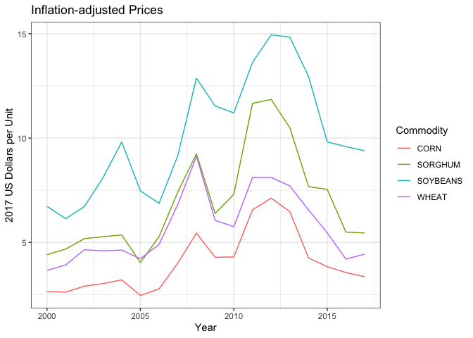
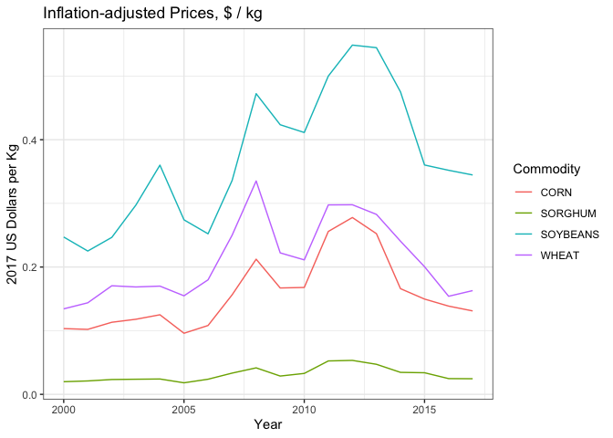
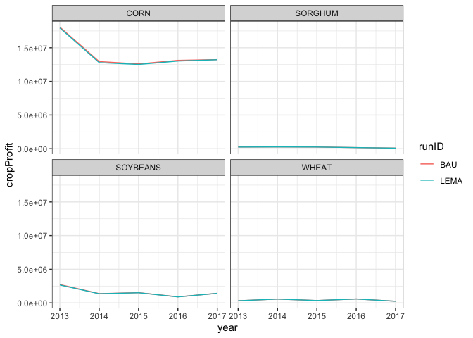
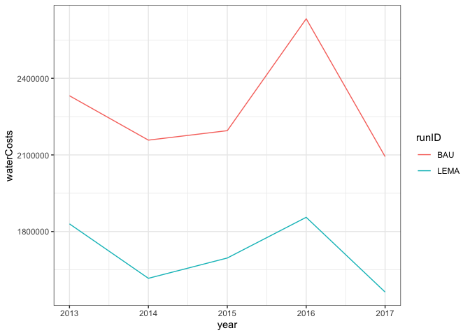

Goal: Calculate monetary differences between pre-lema irrigation behavior model and LEMA irrigation behavior model

* income: crop yield * commodity prices
* energy savings and cost


**R Packages Needed**


```r
library(tidyverse)
library(here)

sessionInfo()
```

```
## R version 3.5.1 (2018-07-02)
## Platform: x86_64-apple-darwin15.6.0 (64-bit)
## Running under: macOS  10.14
## 
## Matrix products: default
## BLAS: /Library/Frameworks/R.framework/Versions/3.5/Resources/lib/libRblas.0.dylib
## LAPACK: /Library/Frameworks/R.framework/Versions/3.5/Resources/lib/libRlapack.dylib
## 
## locale:
## [1] en_US.UTF-8/en_US.UTF-8/en_US.UTF-8/C/en_US.UTF-8/en_US.UTF-8
## 
## attached base packages:
## [1] stats     graphics  grDevices utils     datasets  methods   base     
## 
## other attached packages:
##  [1] here_0.1        forcats_0.3.0   stringr_1.4.0   dplyr_0.8.0.1  
##  [5] purrr_0.2.5     readr_1.1.1     tidyr_0.8.1     tibble_2.0.1   
##  [9] ggplot2_3.2.0   tidyverse_1.2.1
## 
## loaded via a namespace (and not attached):
##  [1] Rcpp_1.0.0       cellranger_1.1.0 pillar_1.3.1     compiler_3.5.1  
##  [5] tools_3.5.1      digest_0.6.16    lubridate_1.7.4  jsonlite_1.6    
##  [9] evaluate_0.11    nlme_3.1-137     gtable_0.2.0     lattice_0.20-35 
## [13] pkgconfig_2.0.2  rlang_0.4.5      cli_1.0.1        rstudioapi_0.7  
## [17] yaml_2.2.0       haven_1.1.2      withr_2.1.2      xml2_1.2.0      
## [21] httr_1.3.1       knitr_1.20       generics_0.0.2   hms_0.4.2       
## [25] rprojroot_1.3-2  grid_3.5.1       tidyselect_0.2.5 glue_1.3.0      
## [29] R6_2.2.2         readxl_1.1.0     rmarkdown_1.10   modelr_0.1.2    
## [33] magrittr_1.5     backports_1.1.2  scales_1.0.0     htmltools_0.3.6 
## [37] rvest_0.3.2      assertthat_0.2.0 colorspace_1.3-2 stringi_1.2.4   
## [41] lazyeval_0.2.1   munsell_0.5.0    broom_0.5.2      crayon_1.3.4
```

*Directories*


```r
baseDir <- here::here()

# price data ------------
priceDir <- paste0(baseDir,'/data/tabular/pricing/commodityPrices')
# filename for inflation adjustment table (made in inflationTable chunk)
cpiFile <- 'cpi_priceAdjustments.csv'
# prices downloaded from NASS
nassRawFile <- 'NASS_price_commodity5_2000-2017.csv'


# salus output ------------------
salusDir <- paste0(baseDir, '/data/SALUS_output')
BAUmodel <- '2_BAU_0054'
LEMAmodel <- '3_LEMA_0086'

# wimas well data
wellDir <- paste0(baseDir, '/data/tabular/wellData')
wellFileName<- 'WIMAS_1996-2016_SheridanNull9_convertedUnits.csv'
```

# Load stuff

## price data
Price data was downloaded manually from the NASS quickstats tool (https://quickstats.nass.usda.gov/) for the following query: SURVEY - CROPS - FIELD CROPS - CORN/SOYBEANS/WHEAT/HAY/SORGHUM - PRICE RECEIVED - 

* CORN, GRAIN - PRICE RECEIVED, MEASURED IN $ / BU
* HAY, PRICE RECEIVED, MEASURED IN $ / TON (short ton)
* SORGHUM, GRAIN - PRICE RECEIVED, MEASURED IN $ / CWT (hundredweight, == 100 lbs)
* SOYBEANS - PRICE RECEIVED, MEASURED IN $ / BU
* WHEAT - PRICE RECEIVED, MEASUTED IN $ / BU

- TOTAL - NATIONAL - US TOTAL - 2000:2017 - ANNUAL - YEAR


Here, I load the data and clean it to have consistent pricing across crops and years

Weights of crops per bushel:

UNC site says 

* corn, shelled: 56 lbs per bushel  
* corn, ear: 70
* corn (in ear):35

crop | pounds/bushel | 1 bu/acre = 
--------------- | ------ | --------
corn/sorghum | 56 | 62.89 kg/ha
soy/wheat | 60 | 67.11 kg/ha

* https://www.extension.iastate.edu/agdm/wholefarm/html/c6-80.html
* http://www.unc.edu/~rowlett/units/scales/bushels.html

sorghum: CWT = 100 lbs

1 lb = 0.4536 kg
1 kg = 2.2 lbs


```r
# make a units columns 
unitkey <- data.frame(Commodity = c('CORN','HAY','SORGHUM','SOYBEANS','WHEAT'),
                      unit = c('BU','TON','CWT','BU','BU'),
                      stringsAsFactors = FALSE)

# load consumer price index adjustments
cpi <- read_csv(paste0(priceDir, '/',cpiFile))
```

```
## Parsed with column specification:
## cols(
##   cpi_year = col_integer(),
##   cpi = col_double(),
##   adj_factor_2015 = col_double(),
##   adj_factor_2016 = col_double(),
##   adj_factor_2017 = col_double()
## )
```

```r
# load nass
price0 <- read_csv(paste0(priceDir, '/', nassRawFile)) %>%
  left_join(unitkey, by = c('Commodity')) %>%
  dplyr::select(c(Commodity, Year, Value, unit))
```

```
## Parsed with column specification:
## cols(
##   .default = col_character(),
##   Year = col_integer(),
##   Value = col_double()
## )
```

```
## See spec(...) for full column specifications.
```

```r
# add the adjustment factor
price <- merge(price0, cpi[,c('cpi_year','adj_factor_2017')], 
               by.x = 'Year', by.y = 'cpi_year')

# adjust prices (note: matched trials at https://data.bls.gov/cgi-bin/cpicalc.pl)
price$price_2017 <- price$Value / price$adj_factor_2017

# adjust to price per kg
kgConverter <- data.frame(Commodity = c('CORN','WHEAT','SOYBEANS','SORGHUM'),
                 nassToKgConversion = c(0.039,  0.0367, 0.0367, 0.0045),
                 stringsAsFactors = F)
priceKg <- price %>%
  left_join(kgConverter, by = c('Commodity')) %>%
  mutate(price_2017_kg = price_2017 * nassToKgConversion) %>%
  filter(Commodity != 'HAY')

# plot it
ggplot(data = priceKg, 
       aes(x=Year, y = price_2017, color = Commodity, group = Commodity)) +
  ylab('2017 US Dollars per Unit') +
  geom_line() +
  theme_bw() +
  ggtitle('Inflation-adjusted Prices')
```

<!-- -->

```r
ggplot(data = priceKg, 
       aes(x=Year, y = price_2017_kg, color = Commodity, group = Commodity)) +
  ylab('2017 US Dollars per Kg') +
  geom_line() +
  theme_bw() +
  ggtitle('Inflation-adjusted Prices, $ / kg')
```

<!-- -->

## Energy Prices
https://www.npr.org/sections/money/2011/10/27/141766341/the-price-of-electricity-in-your-state - KS wide = 10.5 cents per kWh
https://www.electricitylocal.com/states/kansas/

* commericial: 9.24
* industrial: 7.09
* residential: 11.24

## SALUS data

### total region yields


```r
cropKey <- data.frame(cropFull = c('CORN','SORGHUM','WHEAT','SOYBEANS','ALFALFA'),
                      crop = c('MZ','SG','WH','SB','AL'),
                      stringsAsFactors = FALSE)


bau <- read_csv(paste0(salusDir,'/', BAUmodel, '/results/yields_statsAndTotals.csv')) %>%
  mutate(runID = '0054')
```

```
## Parsed with column specification:
## cols(
##   year = col_integer(),
##   irrigated = col_character(),
##   crop = col_character(),
##   yield_total_kg = col_double(),
##   yield_min_kgha = col_double(),
##   yield_Q1_kgha = col_double(),
##   yield_median_kgha = col_double(),
##   yield_mean_kgha = col_double(),
##   yield_Q3_kgha = col_integer(),
##   yield_max_kgha = col_integer()
## )
```

```r
lema <- read_csv(paste0(salusDir,'/', LEMAmodel, '/results/yields_statsAndTotals.csv')) %>%
  mutate(runID = '0086')
```

```
## Parsed with column specification:
## cols(
##   year = col_integer(),
##   irrigated = col_character(),
##   crop = col_character(),
##   yield_total_kg = col_double(),
##   yield_min_kgha = col_double(),
##   yield_Q1_kgha = col_double(),
##   yield_median_kgha = col_double(),
##   yield_mean_kgha = col_double(),
##   yield_Q3_kgha = col_integer(),
##   yield_max_kgha = col_integer()
## )
```

```r
yield0 <- bau %>%
  bind_rows(lema) %>%
  left_join(cropKey, by = 'crop') %>%
  filter(cropFull != 'ALFALFA') %>%
  filter(irrigated == 'Y') %>%
  mutate(runID = recode(runID, '0086' = 'LEMA', '0054' = 'BAU')) %>%
  dplyr::select(c(runID, year, cropFull, yield_total_kg)) %>%
  rename(totalYield_kg =  yield_total_kg)
```

### total water use
based on summary output from 04.10_salusAnalyses_waterSA.Rmd


```r
# load combined wimas/salus water data, median salus yields, nass yields
# load wimas data for sheridan 6
wimasAnnual <- read_csv(paste0(wellDir, '/', wellFileName)) %>%
  filter(masterid == 'sheridan') %>%
  group_by(year) %>%
  summarise(wimasVolume_m3 = sum(volume_m3, na.rm=TRUE),
            wimasArea_m2 = sum(area_m2, na.rm=TRUE),
            wimasDepth_mm = mean(depth_m * 1000, na.rm=TRUE)) %>%
  mutate(wimasArea_ha = wimasArea_m2 * 1e-4,
         wimasVolume_km3 = wimasVolume_m3 * 1e-9,
         datasource = 'WIMAS') %>%
  dplyr::select(c(year, wimasVolume_km3))
```

```
## Parsed with column specification:
## cols(
##   masterid = col_character(),
##   year = col_integer(),
##   PDIV_ID = col_integer(),
##   crop = col_integer(),
##   volume_m3 = col_double(),
##   area_m2 = col_double(),
##   depth_m = col_double(),
##   system = col_integer()
## )
```

```r
# salus
bau2 <- read_csv(paste0(salusDir,'/', BAUmodel, '/results/WaterVars_meansTotals.csv')) %>%
  mutate(runID = '0054')
```

```
## Parsed with column specification:
## cols(
##   year = col_integer(),
##   variable = col_character(),
##   totalVolume_m3 = col_double(),
##   totalVolume_km3 = col_double(),
##   depth_min_mm = col_double(),
##   depth_Q1_mm = col_double(),
##   depth_median_mm = col_double(),
##   depth_mean_mm = col_double(),
##   depth_Q3_mm = col_double(),
##   depth_max_mm = col_double()
## )
```

```r
lema2 <- read_csv(paste0(salusDir,'/', LEMAmodel, '/results/WaterVars_meansTotals.csv')) %>%
  mutate(runID = '0086')
```

```
## Parsed with column specification:
## cols(
##   year = col_integer(),
##   variable = col_character(),
##   totalVolume_m3 = col_double(),
##   totalVolume_km3 = col_double(),
##   depth_min_mm = col_double(),
##   depth_Q1_mm = col_double(),
##   depth_median_mm = col_double(),
##   depth_mean_mm = col_double(),
##   depth_Q3_mm = col_double(),
##   depth_max_mm = col_double()
## )
```

```r
water <- bau2 %>%
  bind_rows(lema2) %>%
  filter(year >= 2013) %>%
  mutate(datasource = 'salus') %>%
  filter(variable == 'irrigation') %>%
  mutate(runID = recode(runID, '0086' = 'LEMA', '0054' = 'BAU'),
         salusVolume_km3 = totalVolume_m3 * 1e-9,
         salusVol_90adj =  salusVolume_km3 / 0.9) %>%
  select(c(runID, year, salusVolume_km3, salusVol_90adj)) %>%
  left_join(wimasAnnual, by = c('year'))
```

# Calculate income loss and savings


```r
# crop profit
priceSlim <- priceKg %>%
  rename(crop = Commodity,
         year = Year) %>%
  dplyr::select(c(year, crop, price_2017_kg))

yieldPrices <- yield0 %>% 
  rename(crop = cropFull) %>%
  left_join(priceSlim, by = c('year','crop')) %>%
  mutate(cropProfit = totalYield_kg * price_2017_kg) %>%
  filter(year >= 2013)

ggplot(yieldPrices,
       aes(year, cropProfit, color = runID, group = runID)) +
  geom_line() +
  facet_wrap(~crop)+
  theme_bw()
```

<!-- -->

```r
yieldPrices
```

```
## # A tibble: 40 x 6
##    runID  year crop  totalYield_kg price_2017_kg cropProfit
##    <chr> <int> <chr>         <dbl>         <dbl>      <dbl>
##  1 BAU    2013 CORN      71593102.         0.252  18069984.
##  2 BAU    2014 CORN      78012502.         0.166  12950106.
##  3 BAU    2015 CORN      84183907.         0.150  12599270.
##  4 BAU    2016 CORN      94715559.         0.139  13129716.
##  5 BAU    2017 CORN     101037549.         0.131  13239960.
##  6 BAU    2013 WHEAT      1142477.         0.283    322977.
##  7 BAU    2014 WHEAT      2404140.         0.241    578405.
##  8 BAU    2015 WHEAT      1774861.         0.200    355748.
##  9 BAU    2016 WHEAT      3833819.         0.154    590649.
## 10 BAU    2017 WHEAT      1524134.         0.163    248355.
## # … with 30 more rows
```

```r
# total diff
cropProfit <- yieldPrices %>% 
  group_by(runID, year) %>%
  summarise(cropIncome = sum(cropProfit)) %>%
  tidyr::spread(., runID, cropIncome) 
cropProfit
```

```
## # A tibble: 5 x 3
##    year       BAU      LEMA
##   <int>     <dbl>     <dbl>
## 1  2013 21377841. 21183697.
## 2  2014 15182460. 15003266.
## 3  2015 14737243. 14639145.
## 4  2016 14793577. 14678650.
## 5  2017 15004331. 14986313.
```

```r
# difference
cropLossByYear <- cropProfit %>% 
  mutate(cropIncomeLoss = LEMA - BAU)
cropLossByYear
```

```
## # A tibble: 5 x 4
##    year       BAU      LEMA cropIncomeLoss
##   <int>     <dbl>     <dbl>          <dbl>
## 1  2013 21377841. 21183697.       -194144.
## 2  2014 15182460. 15003266.       -179193.
## 3  2015 14737243. 14639145.        -98098.
## 4  2016 14793577. 14678650.       -114926.
## 5  2017 15004331. 14986313.        -18019.
```

```r
# money lost, 2013-2017 period
totalMoneyLostCrop <- sum(cropLossByYear$cropIncomeLoss)
totalMoneyLostCrop
```

```
## [1] -604380.9
```

```r
# total percent decline in income
cropLossByYear %>%
  summarize(BAU_totalincome = sum(BAU),
            LEMA_totalincome = sum(LEMA))
```

```
## # A tibble: 1 x 2
##   BAU_totalincome LEMA_totalincome
##             <dbl>            <dbl>
## 1       81095452.        80491071.
```

```r
(1-(80491071/81095452)) * 100
```

```
## [1] 0.7452711
```

### crop water use
* 1 kwh = 3.6 MJ

* commericial: 9.24
* industrial: 7.09
* residential: 11.24


```r
# water costs -----------------------------
energyDollarsPerkWh <- 7.09 * 1e-2
energyDollarsPerMJ <- energyDollarsPerkWh / 3.6

waterCosts <- water %>%
  mutate(volume_m3 = salusVol_90adj * 1e9,
         MJ = volume_m3 * 3.1) %>%
  mutate(waterCosts = MJ * energyDollarsPerMJ)
waterCosts
```

```
## # A tibble: 10 x 8
##    runID  year salusVolume_km3 salusVol_90adj wimasVolume_km3 volume_m3
##    <chr> <int>           <dbl>          <dbl>           <dbl>     <dbl>
##  1 BAU    2013          0.0292         0.0324          0.0244 32435387.
##  2 BAU    2014          0.0270         0.0300          0.0250 30018768.
##  3 BAU    2015          0.0275         0.0305          0.0206 30534515.
##  4 BAU    2016          0.0330         0.0366          0.0232 36629181.
##  5 BAU    2017          0.0262         0.0291         NA      29122116 
##  6 LEMA   2013          0.0229         0.0255          0.0244 25458448.
##  7 LEMA   2014          0.0202         0.0225          0.0250 22492422.
##  8 LEMA   2015          0.0212         0.0236          0.0206 23598611.
##  9 LEMA   2016          0.0232         0.0258          0.0232 25815608 
## 10 LEMA   2017          0.0196         0.0217         NA      21745046.
## # … with 2 more variables: MJ <dbl>, waterCosts <dbl>
```

```r
ggplot(waterCosts, 
       aes(year, waterCosts, color = runID, group = runID)) +
  geom_line() +
  theme_bw()
```

<!-- -->

```r
# total change in water costs
yearlySavings <- waterCosts %>%
  dplyr::select(c(runID, year, waterCosts)) %>%
  tidyr::spread(., key = runID, value = waterCosts) %>%
  mutate(savings = BAU - LEMA)
yearlySavings
```

```
## # A tibble: 5 x 4
##    year      BAU     LEMA savings
##   <int>    <dbl>    <dbl>   <dbl>
## 1  2013 1980270. 1554309. 425962.
## 2  2014 1832729. 1373225. 459504.
## 3  2015 1864217. 1440761. 423456.
## 4  2016 2236313. 1576115. 660199.
## 5  2017 1777986. 1327595. 450391.
```

```r
# total savings
totalWaterSaved <- sum(yearlySavings$savings)
totalWaterSaved
```

```
## [1] 2419511
```

```r
# percent savings
yearlySavings %>%
  summarize(BAU_totalWaterCosts = sum(BAU),
            LEMA_totalWaterCosts = sum(LEMA))
```

```
## # A tibble: 1 x 2
##   BAU_totalWaterCosts LEMA_totalWaterCosts
##                 <dbl>                <dbl>
## 1            9691516.             7272005.
```

```r
(1-(7272005/9691516)) * 100
```

```
## [1] 24.96525
```

Net savings


```r
totalWaterSaved + totalMoneyLostCrop
```

```
## [1] 1815130
```

