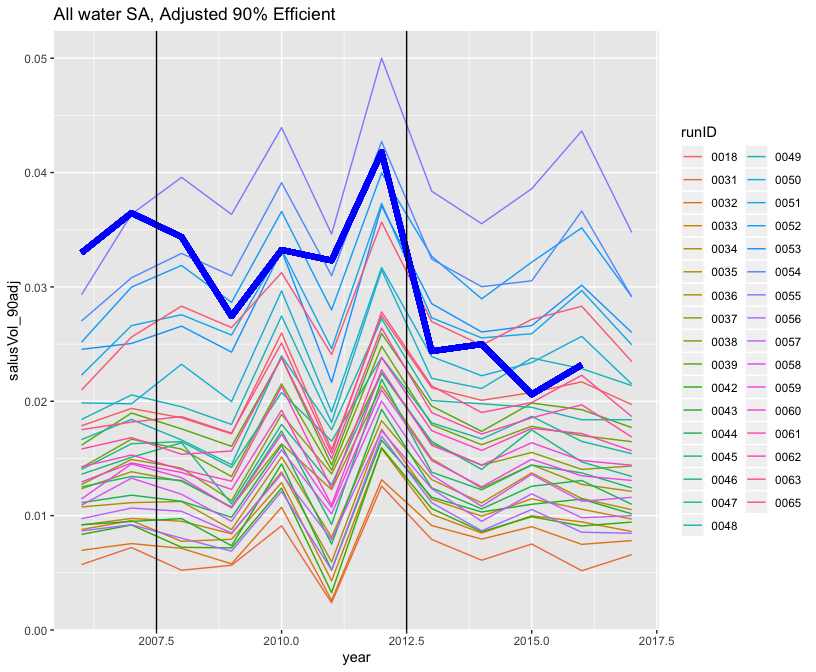

Goal: Analyze SALUS output - comparing salus water use estimates with WIMAS data to identify irrigation parameters.


**R Packages Needed**


```r
library(tidyverse)
library(stringr)
library(purrr)
library(gghighlight)
library(patchwork)
library(here)


# function to easily calculate agreement
source(paste0(here::here(), '/code/misc_functions/calcStats.R'))

sessionInfo()
```

```
## R version 3.5.1 (2018-07-02)
## Platform: x86_64-apple-darwin15.6.0 (64-bit)
## Running under: macOS  10.14.6
## 
## Matrix products: default
## BLAS: /Library/Frameworks/R.framework/Versions/3.5/Resources/lib/libRblas.0.dylib
## LAPACK: /Library/Frameworks/R.framework/Versions/3.5/Resources/lib/libRlapack.dylib
## 
## locale:
## [1] en_US.UTF-8/en_US.UTF-8/en_US.UTF-8/C/en_US.UTF-8/en_US.UTF-8
## 
## attached base packages:
## [1] stats     graphics  grDevices utils     datasets  methods   base     
## 
## other attached packages:
##  [1] here_0.1          patchwork_1.0.0   gghighlight_0.3.0
##  [4] forcats_0.3.0     stringr_1.4.0     dplyr_0.8.0.1    
##  [7] purrr_0.2.5       readr_1.1.1       tidyr_0.8.1      
## [10] tibble_2.0.1      ggplot2_3.2.0     tidyverse_1.2.1  
## 
## loaded via a namespace (and not attached):
##  [1] Rcpp_1.0.6       cellranger_1.1.0 pillar_1.3.1     compiler_3.5.1  
##  [5] tools_3.5.1      digest_0.6.16    lubridate_1.7.4  jsonlite_1.7.2  
##  [9] evaluate_0.11    nlme_3.1-137     gtable_0.2.0     lattice_0.20-35 
## [13] pkgconfig_2.0.2  rlang_0.4.5      cli_2.2.0        rstudioapi_0.7  
## [17] yaml_2.2.0       haven_1.1.2      withr_2.1.2      xml2_1.2.0      
## [21] httr_1.3.1       knitr_1.20       generics_0.0.2   hms_0.4.2       
## [25] rprojroot_1.3-2  grid_3.5.1       tidyselect_0.2.5 glue_1.4.2      
## [29] R6_2.5.0         fansi_0.4.2      readxl_1.1.0     rmarkdown_1.10  
## [33] modelr_0.1.2     magrittr_2.0.1   backports_1.1.2  scales_1.0.0    
## [37] htmltools_0.3.6  rvest_0.3.2      assertthat_0.2.1 colorspace_1.3-2
## [41] stringi_1.2.4    lazyeval_0.2.1   munsell_0.5.0    broom_0.5.2     
## [45] crayon_1.3.4
```

**Directories**


```r
baseDir <- here::here()

# main folder containing SALUS runs
exptDir <- paste0(baseDir, '/data/SALUS_output/0030_waterSA')

# directory containing wimas well data
welldir <- paste0(baseDir, '/data/tabular/wellData')
wellFileName<- 'WIMAS_1996-2016_SheridanNull9_convertedUnits.csv'
```

# Comparison Data

## WIMAS water use data
Load water use data for comparison


```r
# load wimas data for sheridan 6
wimas <- read_csv(paste0(welldir, '/', wellFileName)) %>%
  filter(masterid == 'sheridan')  
```

```
## Parsed with column specification:
## cols(
##   masterid = col_character(),
##   year = col_integer(),
##   PDIV_ID = col_integer(),
##   crop = col_integer(),
##   volume_m3 = col_double(),
##   area_m2 = col_double(),
##   depth_m = col_double(),
##   system = col_integer()
## )
```

```r
# count wells in study area duing study period
wimas %>% 
  filter(year > 2005 & year < 2018) %>%
  filter(!is.na(volume_m3)) %>%
  group_by(PDIV_ID) %>%
  slice(1) %>%
  nrow()
```

```
## [1] 195
```

```r
# get annual volume totals and format to join with SALUS
wimasAnnual <- wimas %>%
  group_by(year) %>%
  summarise(wimasVolume_m3 = sum(volume_m3, na.rm=TRUE),
            wimasArea_m2 = sum(area_m2, na.rm=TRUE),
            wimasDepth_mm = mean(depth_m * 1000, na.rm=TRUE)) %>%
  mutate(wimasArea_ha = wimasArea_m2 * 1e-4,
         wimasVolume_km3 = wimasVolume_m3 * 1e-9,
         datasource = 'WIMAS') %>%
  dplyr::select(c(year, wimasVolume_km3))
```


# SALUS results

## Water Use Runs: Load and combine data
Make a master table of water use runs containing total pumping volume

* The 'datasource' column will be the run ID to facilitate identification. 
* Join runs with parameter values to plot how water use changes with parameters


```r
# list parameter files
paramFiles <- list.files(exptDir, pattern = '*parameters.csv', recursive =TRUE,
                         full.names = TRUE)
# list waterVars files
waterFiles <- list.files(exptDir, pattern = '*WaterVars*', recursive =TRUE,
                         full.names = TRUE)
# list yield files
yieldFiles <- list.files(exptDir, pattern = '*yields*', recursive =TRUE,
                         full.names = TRUE)

# add names to file lists based on file name - run name
names(paramFiles) <- str_sub(paramFiles, -26, -23)
names(waterFiles) <- str_sub(waterFiles, -45, -42)

# load each set of files into 1 data frame --------

# params: keep only water relevant ones - get 1 param set per run
params <- purrr::map_df(paramFiles, read_csv, col_types = cols(), .id='runID') %>%
  dplyr::select(c(year, runID, crop, ThetaC, AIrAm)) %>%
  group_by(year, runID) %>%
  summarize(ThetaC = median(ThetaC, na.rm = TRUE),
            AIrAm = median(AIrAm, na.rm=TRUE))

# water: add data source, extract just irrigation volume
water <- purrr::map_df(waterFiles, read_csv, col_types = cols(), .id='runID') %>%
  mutate(datasource = 'salus') %>%
  filter(variable == 'irrigation') %>%
  mutate(salusVolume_km3 = totalVolume_m3 * 1e-9) %>%
  dplyr::select(c(runID, year, salusVolume_km3))

# combine  ----------------
master <- water %>%
  left_join(params, by = c('year', 'runID')) %>%
  left_join(wimasAnnual, by=c('year')) %>%
  mutate(runID_num = as.numeric(runID)) %>%
  filter(runID_num < 66 | runID_num == 86)

# assume a 90% efficiency -------------------------------
master$salusVol_90adj <- master$salusVolume_km3 / 0.9
```

## vis: ID matching runs
Take a look at salus vs wimas irrigation volumes to identify runs which approximate pre-LEMA and LEMA water use


```r
#  90% efficiency -------------------------------
ggplot(master,
       aes(x=year, y = salusVol_90adj, color = runID, group = runID)) +
  geom_line() + 
  # add wimas
  geom_line(data = master, 
            aes(x=year, y = wimasVolume_km3), color = 'blue', lwd=2) +
  geom_vline(xintercept = 2007.5) +
   geom_vline(xintercept = 2012.5) +
  ggtitle('All water SA, Adjusted 90% Efficient')
```

```
## Warning: Removed 33 rows containing missing values (geom_path).
```

<!-- -->

```r
# highlight runs  that look ok for pre_LEMA
ggplot(master, 
                 aes(x=year, y = salusVol_90adj, color = runID,
                     group = runID)) +
  geom_line() +
  gghighlight(max(salusVol_90adj) > .034) +
  # add wimas
  geom_line(data = master, 
            aes(x=year, y = wimasVolume_km3), color = 'blue', lwd=2) +
    geom_vline(xintercept = 2007.5) +
   geom_vline(xintercept = 2012.5) +
  ggtitle('ID salus runs at 90% for pre-LEMA period')
```

```
## label_key: runID
```

```
## Warning: Removed 33 rows containing missing values (geom_path).
```

<!-- -->

```r
# highlight runs for LEMA
ggplot(master, 
                 aes(x=year, y = salusVol_90adj, color = runID,
                     group = runID))  +
  geom_line() +
  gghighlight(max(salusVol_90adj) < .033 & max(salusVol_90adj) > .027) +
  # add wimas
  geom_line(data = master, 
            aes(x=year, y = wimasVolume_km3), color = 'blue', lwd=2) +
    geom_vline(xintercept = 2007.5) +
   geom_vline(xintercept = 2012.5) +
  ggtitle('ID salus runs at 90% for LEMA period')
```

```
## label_key: runID
```

```
## Warning: Removed 33 rows containing missing values (geom_path).
```

<!-- -->

## Quantify best runs
use error metrics to pick the best


```r
preLemaData <- master %>% filter(year > 2007 & year < 2013)
LemaData <- master %>% filter(year > 2012)

preLemaAgreement <- preLemaData %>%
  group_by(runID) %>%
  do(as.data.frame(calcStats(.$salusVol_90adj,.$wimasVolume_km3))) %>%
  arrange(mae)
preLemaAgreement
```

```
## # A tibble: 33 x 11
## # Groups:   runID [33]
##    runID    r2    rmse   vecv     mae    mdae       me     r     m     int
##    <chr> <dbl>   <dbl>  <dbl>   <dbl>   <dbl>    <dbl> <dbl> <dbl>   <dbl>
##  1 0054  0.667 0.00321   51.7 0.00262 0.00144  1.51e-3 0.817 0.797 0.00568
##  2 0052  0.679 0.00286   61.8 0.00264 0.00249 -8.14e-4 0.824 0.825 0.00660
##  3 0051  0.648 0.00507  -20.2 0.00414 0.00448 -4.12e-3 0.805 0.771 0.0109 
##  4 0065  0.655 0.00542  -37.1 0.00468 0.00605 -4.68e-3 0.809 0.933 0.00664
##  5 0053  0.589 0.00642  -93.0 0.00527 0.00470 -5.27e-3 0.767 0.620 0.0161 
##  6 0055  0.715 0.00766 -175.  0.00707 0.00822  7.07e-3 0.846 0.705 0.00500
##  7 0050  0.592 0.00969 -339.  0.00910 0.0101  -9.10e-3 0.769 0.699 0.0165 
##  8 0049  0.642 0.0114  -508.  0.0109  0.0103  -1.09e-2 0.801 0.671 0.0185 
##  9 0018  0.518 0.0133  -730.  0.0128  0.0143  -1.28e-2 0.719 0.694 0.0193 
## 10 0063  0.567 0.0134  -739.  0.0130  0.0140  -1.30e-2 0.753 0.730 0.0186 
## # … with 23 more rows, and 1 more variable: rmspe <dbl>
```

```r
# highlight runs for preLEMA
preLemaW <- master %>%
  filter(runID %in% c('0054','0051','0052'))

ggplot(preLemaW, 
                 aes(x=year, y = salusVol_90adj, color = runID,
                     group = runID))  +
  geom_line() +
  # add wimas
  geom_line(data = master, 
            aes(x=year, y = wimasVolume_km3), color = 'blue', lwd=2) +
    geom_vline(xintercept = 2007.5) +
   geom_vline(xintercept = 2012.5) +
  ggtitle('ID salus runs at 90% for LEMA period')
```

```
## Warning: Removed 33 rows containing missing values (geom_path).
```

<!-- -->

```r
# highlight runs for pre_LEMA - best
ggplot(master, 
                 aes(x=year, y = salusVol_90adj*1e3, color = runID,
                     group = runID)) +
  geom_line() +
  gghighlight(runID %in% c('0054')) +
  scale_x_continuous(breaks = c(2006, 2010, 2014, 2017)) +
  # add wimas
  geom_line(data = master, 
            aes(x=year, y = wimasVolume_km3*1e3), color = 'blue', lwd=2) +
    geom_vline(xintercept = 2007.5) +
   geom_vline(xintercept = 2012.5) +
  theme_bw() + ylab('Water Extracted (million m^3)')
```

```
## Warning: Tried to calculate with group_by(), but the calculation failed.
## Falling back to ungrouped filter operation...
```

```
## label_key: runID
```

```
## Warning: Removed 33 rows containing missing values (geom_path).
```

<!-- -->


```r
## lema period
LemaAgreement <- LemaData %>%
  group_by(runID) %>%
  filter(year < 2017) %>% # 2017 wasn't available during time of model selection
  do(as.data.frame(calcStats(.$salusVol_90adj, .$wimasVolume_km3))) %>%
  arrange(mae)
LemaAgreement
```

```
## # A tibble: 33 x 11
## # Groups:   runID [33]
##    runID      r2    rmse   vecv     mae    mdae       me       r       m
##    <chr>   <dbl>   <dbl>  <dbl>   <dbl>   <dbl>    <dbl>   <dbl>   <dbl>
##  1 0050  3.83e-2 0.00233  -92.7 0.00213 0.00263  5.14e-4 -0.196  -0.265 
##  2 0018  4.04e-2 0.00302 -223.  0.00244 0.00234 -2.36e-3 -0.201  -0.572 
##  3 0049  9.19e-1 0.00278 -173.  0.00244 0.00278 -8.48e-4 -0.959  -1.63  
##  4 0063  3.00e-4 0.00340 -308.  0.00266 0.00197 -2.66e-3 -0.0173 -0.0231
##  5 0065  2.56e-1 0.00436 -572.  0.00359 0.00386  3.55e-3 -0.506  -0.694 
##  6 0051  2.07e-3 0.00445 -601.  0.00382 0.00411  3.82e-3  0.0455  0.0471
##  7 0048  9.18e-2 0.00418 -519.  0.00386 0.00456 -3.86e-3  0.303   0.800 
##  8 0039  4.60e-1 0.00492 -757.  0.00427 0.00435 -4.27e-3 -0.678  -1.17  
##  9 0053  4.97e-3 0.00508 -812.  0.00455 0.00509  4.55e-3  0.0705  0.0731
## 10 0062  1.04e-1 0.00517 -844.  0.00469 0.00443 -4.69e-3 -0.323  -0.581 
## # … with 23 more rows, and 2 more variables: int <dbl>, rmspe <dbl>
```

```r
# highlight runs for pre_LEMA
ggplot(master, 
                 aes(x=year, y = salusVol_90adj*1e3, color = runID,
                     group = runID)) +
  geom_line() +
  gghighlight(runID %in% c('0050')) +
  scale_x_continuous(breaks = c(2006, 2010, 2014, 2017)) +
  # add wimas
  geom_line(data = master, 
            aes(x=year, y = wimasVolume_km3*1e3), color = 'blue', lwd=2) +
    geom_vline(xintercept = 2007.5) +
   geom_vline(xintercept = 2012.5) +
  theme_bw() + ylab('Water Extracted (million m^3)')
```

```
## Warning: Tried to calculate with group_by(), but the calculation failed.
## Falling back to ungrouped filter operation...
```

```
## label_key: runID
```

```
## Warning: Removed 33 rows containing missing values (geom_path).
```

<!-- -->


### heat plot


```r
lemaPlot <- LemaAgreement %>%
  dplyr::select(c(runID, mae)) %>%
  left_join(LemaData %>% filter(year == 2013) %>% dplyr::select(c(runID, ThetaC, AIrAm))) %>%
  filter(ThetaC >= 45) %>%
  mutate(period = 'LEMA')
```

```
## Joining, by = "runID"
```

```r
prelemaPlot <- preLemaAgreement %>%
  dplyr::select(c(runID, mae)) %>%
  left_join(preLemaData %>% filter(year == 2012) %>% dplyr::select(c(runID, ThetaC, AIrAm))) %>%
  filter(ThetaC >= 45) %>%
  mutate(period = 'B LEMA') %>%
  bind_rows(lemaPlot) %>%
  mutate(mae2 = mae*1000)
```

```
## Joining, by = "runID"
```

```r
ggplot(prelemaPlot,
       aes(x = as.factor(ThetaC), y = as.factor(AIrAm), fill = mae2)) +
  geom_tile() +
  coord_flip() +
  facet_wrap(~period, nrow = 1) +
  ylab('Irrigation Application Depth (mm)') + xlab('Soil Moisture Threshold (%)') +
  theme_bw() + theme(panel.background = element_rect(fill = 'gray45'),
                     panel.grid = element_blank(),
                                       axis.text=element_text(size=10),
                     legend.text=element_text(size=10),
                     axis.title=element_text(size=11),
                     legend.position = 'top')
```

<!-- -->

## Water Use Sensitivity

Get top model runs for each period


```r
# get top  runs
lemaModels <- LemaAgreement %>%
  ungroup() %>%
  top_n(n=3, wt = -mae) %>%
  mutate(type = 'lema') %>%
  dplyr::select(c(runID, type))
  
BAUmodels <- preLemaAgreement %>%
  ungroup() %>%
  top_n(n=3, wt = -mae) %>%
  mutate(type = 'bau') %>%
  dplyr::select(c(runID, type))

modelsToCompare <- lemaModels %>% bind_rows(BAUmodels)

# get model data
saRuns_allyear <- master %>%
  inner_join(modelsToCompare)
```

```
## Joining, by = "runID"
```

```r
# plot
ggplot(saRuns_allyear %>% filter(year > 2007), 
                 aes(x=year, y = salusVol_90adj*1e3, color = type,
                     group = runID)) +
  geom_line() +
  scale_x_continuous(breaks = c(2008, 2011, 2014, 2017)) +
  # highlight chosen
    geom_line(data = saRuns_allyear %>% filter(year > 2007 & runID == '0054'), lwd=2) +
    geom_line(data = saRuns_allyear %>% filter(year > 2007 & runID == '0050'), lwd=2) +
  # add wimas
  geom_line(data = master %>% filter(year > 2007), 
            aes(x=year, y = wimasVolume_km3*1e3), color = 'blue', lwd=2) +
   geom_vline(xintercept = 2012.5, linetype = 'dashed', col = 'gray40') +
  theme_bw() + ylab('Water Extracted (million m^3)') +
  theme(panel.grid = element_blank())
```

```
## Warning: Removed 33 rows containing missing values (geom_path).
```

<!-- -->

compare water savings

### total


```r
# get each run's 5 year lema total water use
waterUseDiffs <- saRuns_allyear %>%
  dplyr::select(c(runID, type,year, ThetaC, AIrAm, salusVol_90adj)) %>%
  filter(year > 2012) %>%
  group_by(runID, type, ThetaC, AIrAm) %>%
  summarize(totalLemaWater = sum(salusVol_90adj))

# awkwardly make a fully crossed df
# expand lema rows
lemaDf <- waterUseDiffs %>% filter(type == 'lema') %>%
  ungroup() %>%
  rename(runID_lema = runID,
         ThetaC_lema = ThetaC,
         AIrAm_lema = AIrAm,
         water_lema = totalLemaWater) %>%
  dplyr::select(-c(type)) 

lema5 <- lemaDf %>% slice(rep(row_number(), 3)) %>%
  arrange(runID_lema)

# get bau rows
bauDf <- waterUseDiffs %>% filter(type == 'bau') %>%
  ungroup() %>%
  rename(runID_bau = runID,
         ThetaC_bau = ThetaC,
         AIrAm_bau = AIrAm,
         water_bau = totalLemaWater) %>%
  dplyr::select(-c(type)) %>% slice(rep(row_number(), 3)) 

#smoosh
combos <- lema5 %>% bind_cols(bauDf) %>%
  mutate(water_diff = water_bau - water_lema,
         water_diff_mm3 = water_diff * 1e3)

ggplot(combos, aes(x = water_diff_mm3)) +
  geom_density(fill = 'lightblue', col = 'transparent') +
  geom_vline(xintercept = 39.6, color = 'red', linetype = 'dashed') +
  theme_bw()+ xlab('Water Saved (million m^3)') +
  theme(panel.grid = element_blank())
```

<!-- -->

```r
ggplot(combos, aes(y = water_diff_mm3)) +
  geom_boxplot(fill = 'lightblue') +
  geom_hline(yintercept = 39.6, color = 'red', linetype = 'dashed') +
  theme_bw()+ ylab('Distribution of Water Saved (million m^3)') +
  theme(panel.grid = element_blank(),
        axis.title.x=element_blank(),
        axis.text.x=element_blank(),
        axis.ticks.x=element_blank())
```

<!-- -->

heatplot?


```r
comboHeat <- combos %>% mutate(params_lema = paste0(ThetaC_lema,'% ',AIrAm_lema,' mm'),
                               params_bau = paste0(ThetaC_bau,'% ',AIrAm_bau, ' mm')) 

ggplot(comboHeat,
       aes(x = as.factor(params_lema), y = as.factor(params_bau), fill = water_diff_mm3)) +
  geom_tile() +
  ylab('BAU Parameters') + xlab('LEMA Parameters') +
  theme_bw() + theme(panel.background = element_rect(fill = 'gray45'),
                     panel.grid = element_blank(),
                     legend.position = 'top',
                     legend.title = element_blank())
```

<!-- -->


Final choices based on MAE and supported by yield comparisons (nothing weird happening): 

* 0054 = BAU: 85% thetaC, 31.8 mm applications (1.25 inch)
* 0050 = LEMA: 80%, 25.0 mm


* update: so 0086 is the LEMA scenario, which has 0054 for pre-LEMA years and 0050 for lema years


