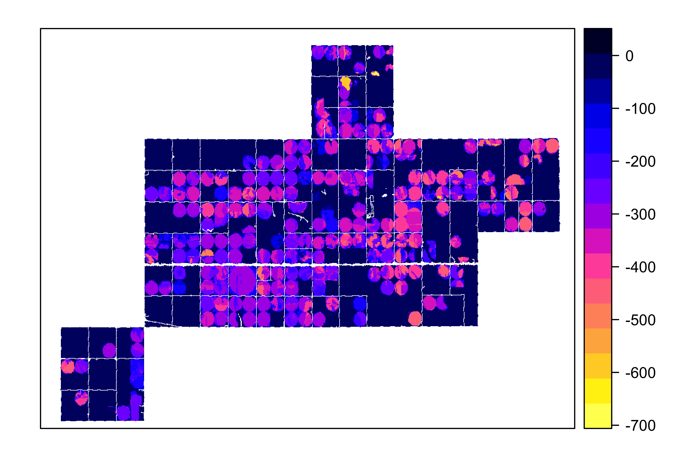

Goal: Make a map of change in recharge between 5 year periods


**R Packages Needed**


```r
library(tidyverse)
library(raster)
library(rgdal)

library(here)

sessionInfo()
```

```
## R version 3.5.1 (2018-07-02)
## Platform: x86_64-apple-darwin15.6.0 (64-bit)
## Running under: macOS  10.14
## 
## Matrix products: default
## BLAS: /Library/Frameworks/R.framework/Versions/3.5/Resources/lib/libRblas.0.dylib
## LAPACK: /Library/Frameworks/R.framework/Versions/3.5/Resources/lib/libRlapack.dylib
## 
## locale:
## [1] en_US.UTF-8/en_US.UTF-8/en_US.UTF-8/C/en_US.UTF-8/en_US.UTF-8
## 
## attached base packages:
## [1] stats     graphics  grDevices utils     datasets  methods   base     
## 
## other attached packages:
##  [1] here_0.1        rgdal_1.3-4     raster_2.6-7    sp_1.3-1       
##  [5] forcats_0.3.0   stringr_1.4.0   dplyr_0.8.0.1   purrr_0.2.5    
##  [9] readr_1.1.1     tidyr_0.8.1     tibble_2.0.1    ggplot2_3.2.0  
## [13] tidyverse_1.2.1
## 
## loaded via a namespace (and not attached):
##  [1] Rcpp_1.0.0       cellranger_1.1.0 pillar_1.3.1     compiler_3.5.1  
##  [5] tools_3.5.1      digest_0.6.16    lubridate_1.7.4  jsonlite_1.6    
##  [9] evaluate_0.11    nlme_3.1-137     gtable_0.2.0     lattice_0.20-35 
## [13] pkgconfig_2.0.2  rlang_0.4.5      cli_1.0.1        rstudioapi_0.7  
## [17] yaml_2.2.0       haven_1.1.2      withr_2.1.2      xml2_1.2.0      
## [21] httr_1.3.1       knitr_1.20       generics_0.0.2   hms_0.4.2       
## [25] rprojroot_1.3-2  grid_3.5.1       tidyselect_0.2.5 glue_1.3.0      
## [29] R6_2.2.2         readxl_1.1.0     rmarkdown_1.10   modelr_0.1.2    
## [33] magrittr_1.5     backports_1.1.2  scales_1.0.0     htmltools_0.3.6 
## [37] rvest_0.3.2      assertthat_0.2.0 colorspace_1.3-2 stringi_1.2.4   
## [41] lazyeval_0.2.1   munsell_0.5.0    broom_0.5.2      crayon_1.3.4
```

# recharge 


```r
# load recharge
salusDir <- paste0(here::here(), '/data/SALUS_output')
BAUmodel <- '2_BAU_0054'
LEMAmodel <- '3_LEMA_0086'


r0054 <- readRDS(paste0(salusDir, '/', BAUmodel,'/results/Rch_stack.rds'))
r0086 <- readRDS(paste0(salusDir, '/', LEMAmodel,'/results/Rch_stack.rds'))

# keep just 2013-2017 ------------------

#year names to keep
years <- paste0('X', 2013:2017)

# subset
bau <- r0054[[years]]
lema <- r0086[[years]]

# get total recharge
bau5 <- sum(bau)
lema5 <- sum(lema)

rechargeReduction <- lema5 - bau5
```

# nice figure


```r
# reproject
classProj <- '+proj=aea +lat_1=20 +lat_2=60 +lat_0=40 +lon_0=-101 +x_0=0 +y_0=0 +datum=NAD83 +units=m +no_defs +ellps=GRS80 +towgs84=0,0,0'
deltaR <- projectRaster(rechargeReduction, crs=classProj, res=30, method='ngb')

# plot
spplot(deltaR, col.regions = rev(bpy.colors(16)),
       maxpixels = 800000)
```

<!-- -->


